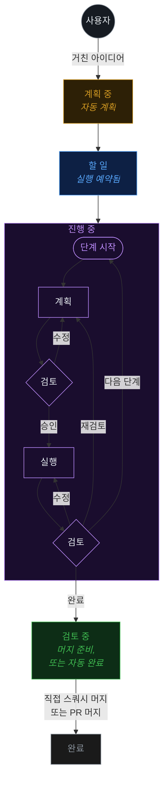

<div align="center">


# Fusion

### 거친 아이디어에서 프로덕션 코드까지 — 자동으로.

**멀티 노드 에이전트 오케스트레이터** — 태스크, 에이전트, 미션, git, 파일, 워크트리를 어떤 모델에서도, 로컬 또는 클라우드에서 실행합니다.

[**runfusion.ai →**](https://runfusion.ai) · [문서](./docs/README.md) · [GitHub](https://github.com/Runfusion/Fusion) · [npm](https://www.npmjs.com/package/@runfusion/fusion) · [Discord](https://discord.gg/ksrfuy7WYR)

[English](./README.md) · [简体中文](./README.zh-CN.md) · [繁體中文](./README.zh-TW.md) · [Français](./README.fr.md) · [Español](./README.es.md) · **한국어**

*이 문서는 기계 번역본입니다. 공식 원본은 [영문 README](./README.md)를 참조하세요.*

[](./LICENSE)
[](https://www.npmjs.com/package/@runfusion/fusion)
[](https://discord.gg/ksrfuy7WYR)


<br />


<br />
<br />

<a href="https://runfusion.ai">
  
</a>

</div>

---

## 전체 개발 환경을 하나의 화면에서.

평문으로 태스크를 설명하면, 계획 에이전트가 프로젝트를 읽고 컨텍스트를 파악한 뒤 단계, 파일 범위, 완료 기준이 담긴 `PROMPT.md` 계획서를 작성합니다. 이후 Fusion은 격리된 git 워크트리에서 계획, 검토, 실행, 재검토를 순서대로 수행하며, 원하는 곳마다 사람의 승인 단계를 추가할 수 있습니다.

보드 하나로. 어디서든 제어. 노트북, Mac mini, Linux 서버, 클라우드 VM, 휴대폰 — 모두 연결됩니다.

> Trello와 유사하지만, 태스크의 명세 작성, 실행, 납품을 AI가 수행합니다. [dustinbyrne/kb](https://github.com/dustinbyrne/kb)의 훌륭한 작업을 기반으로 구축되었습니다.

---

## 흐름

```
  ①  설명              ②  계획                ③  보드               ④  격리된 워크트리
  ─────────────        ─────────────         ─────────────          ─────────────────────
  "설정 패널에      →   에이전트가         →   계획 → 검토 →     →   fusion/FN-123 브랜치
   다크 모드 토글       PROMPT.md 작성          실행 → 검토             동시 실행,
   추가"               (단계, 범위,            (각 단계마다,           파일 충돌 없음
                       완료 기준)              완료까지)
```

### 머지 전에 모든 단계를 확인하세요

<div align="center">
  
</div>

모든 태스크는 계획, 검토, 차이점, 파일 변경 내역을 실시간으로 보여줍니다. 진행 중인 태스크에 들어가 방향을 조정하거나, 제약을 강화하거나, 일시 정지하거나, 재프롬프트할 수 있습니다.

---

## 차별점

|  |  |
|---|---|
| 🧠 **AI 계획** | 평문으로 태스크를 설명하면, 계획 에이전트가 단계, 파일 범위, 완료 기준이 포함된 `PROMPT.md` 계획서로 변환합니다. |
| 🔁 **워크플로우 게이트** | 모든 단계마다 계획 → 검토 → 실행 → 검토 주기를 거칩니다. 사전 머지 게이트는 불량 코드를 차단하고, 사후 머지 게이트는 정보성 검사를 실행합니다. |
| 🌳 **워크트리 격리** | 각 태스크는 자체 브랜치와 워크트리(`fusion/{task-id}`)에서 실행됩니다. 병렬 태스크. 충돌 없음. [`worktrunk.enabled`](./docs/settings-reference.md#worktree-backend-settings)를 통한 선택적 [worktrunk](https://github.com/max-sixty/worktrunk) 위임 지원([WorktreeBackend 추상화](./docs/architecture.md#worktreebackend-abstraction) 참조). |
| ⚡ **스마트 머지** | 모든 게이트 통과 시 Fusion이 스쿼시 머지하고 다음으로 넘어갑니다. 어디서든 수동 승인을 선택할 수 있습니다. |
| 🛰️ **멀티 노드 메시** | 노트북, Mac mini, Linux 서버, 클라우드 VM, 휴대폰 — 모두 동기화됩니다. 데스크톱, 모바일, 웹. |
| 🧩 **모든 모델** | Anthropic, OpenAI, Ollama 등 다양한 모델을 지원합니다. 로컬과 클라우드가 공존합니다. |
| 🏢 **에이전트 컴퍼니** | 사전 구축된 팀 — 16개 컴퍼니에 걸쳐 440개 이상의 에이전트 — 을 임포트하여 몇 주 동안 자율적으로 실행합니다. |
| 📬 **에이전트 간 메시징** | 에이전트 간 내장 메일박스. 위임, 확인, 조율이 가능합니다. |
| 🗨️ **멀티 에이전트 채팅 룸** | 여러 룸 구성원이 답할 수 있는 프로젝트 범위 그룹 대화: 언급된 구성원은 직접 응답자로, 추가 주변 구성원은 최대 한도까지 응답할 수 있습니다. 현재 **실험적** — **설정 → 실험적 기능 → 채팅 룸**에서 `chatRooms`를 활성화하세요. ([채팅 룸 문서](./docs/dashboard-guide.md#chat-rooms)) |
| 🗺️ **미션** | 계층적 계획(미션 → 마일스톤 → 슬라이스 → 기능 → 태스크), 자동 조종, 검증 계약 포함. |
| 🔬 **리서치** | 웹 검색, GitHub, 로컬 문서, LLM 합성을 활용한 경계 있는 리서치 실행(계획 및 합성 흐름에서 런타임 내장 WebSearch/WebFetch 지원 포함). 결과를 태스크로 전환합니다. ([문서](./docs/research.md)) |
| 🧪 **자기 개선** | 에이전트가 자신의 출력물을 돌아보고 코드베이스를 학습하면서 프롬프트를 업데이트합니다. |
| 🔓 **오픈 소스. MIT.** | 벤더 종속 없음. 자체 하드웨어에서 실행. 매주 배포. |

---

## 작동 방식



의존성이 있는 태스크는 순차적으로 처리됩니다. 독립적인 태스크는 병렬로 실행됩니다. 태스크가 계획 단계에서 할 일로 이동하기 전에 수동 승인을 요구하도록 설정할 수 있습니다(`requirePlanApproval` 설정).

---

## 멀티 노드. 하나의 보드. 모든 플랫폼.

<div align="center">


<br />


</div>

노트북, Mac mini, Linux 서버, 클라우드 VM, 휴대폰 — 모든 노드가 동등한 피어입니다. 태스크 상태, 에이전트, 로그, 차이점이 메시 전반에 걸쳐 동기화된 상태로 유지됩니다. 동일한 Fusion이 다음과 같이 제공됩니다:

- 🖥️ **데스크톱 앱** — **macOS**(Intel + Apple Silicon), **Windows** 10/11, **Linux**용 Electron
- 📱 **모바일 앱** — **iOS/iPadOS** 및 **Android**용 Capacitor ([MOBILE.md](./MOBILE.md))
- 🌐 **웹 대시보드** — `fn dashboard` 데몬에서 제공되는 모든 최신 브라우저
- 🔌 **CLI** — 터미널 중심 워크플로우를 위한 `fn` 바이너리 + 확장

임의의 노드에서 데몬을 시작하고 다른 기기를 연결하면, 보드가 어디서든 따라다닙니다.

---

## 에이전트 컴퍼니 운영

<div align="center">


</div>

팀을 임포트하세요. 몇 주 동안 자율적으로 운영하세요. 미션, 메일박스, 에이전트 간 위임을 위해 연결된 **16개 컴퍼니에 걸쳐 440개 이상의 에이전트**.

```bash
npx companies.sh add paperclipai/companies/gstack
```

---

## 이미 사용 중인 도구와 호환됩니다.

Fusion은 여러분이 좋아하는 도구와 통합됩니다. **Hermes**, **Paperclip**, **OpenClaw**는 모두 일급 플러그인으로 제공되어 — 작업에 맞는 런타임으로 워크스페이스를 라우팅할 수 있습니다. 그리고 모든 Paperclip 에이전트 컴퍼니는 단일 명령으로 임포트됩니다.

<div align="center">
  
</div>

### [Hermes](https://hermes-agent.nousresearch.com) <sub>`experimental`</sub>

<sub>Nous Research</sub>

**Nous Research**의 오픈 소스 자율 에이전트. Hermes 플러그인을 설치하고 장시간 실행되는 컨텍스트가 증가하는 작업에 Hermes를 통해 에이전트를 실행하세요 — 임의의 Fusion 워크스페이스를 라우팅할 수 있습니다.

### OpenClaw <sub>`experimental`</sub>

OpenClaw 런타임 지원은 런타임 탐색/설정 동등성을 위한 실험적 플러그인(`fusion-plugin-openclaw-runtime`)으로 제공됩니다. 플러그인을 설치한 후 `runtimeConfig.runtimeHint: "openclaw"`로 에이전트를 설정하세요.

<br />

<div align="center">
  
</div>

### [Paperclip](https://paperclip.ing) <sub>`experimental`</sub>

<sub>paperclip.ing</sub>

AI 노동을 위한 사람 제어 플레인. Paperclip 플러그인을 설치하여 Fusion 내에서 Paperclip을 통해 에이전트를 실행하세요.

Fusion은 **[`companies.sh`](https://github.com/paperclipai/companies)** 에이전트 컴퍼니 표준을 네이티브로 지원합니다: 사전 구축된 팀 — **16개 컴퍼니에 걸쳐 440개 이상의 에이전트** — 을 임포트하고, 수 주 동안의 자율 작업을 위해 Fusion의 메일박스, 미션, 워크플로우 게이트를 통해 조율하게 하세요. Paperclip과 동일한 컴퍼니 형식, 동일한 에이전트, 동일한 스킬.

```bash
npx companies.sh add paperclipai/companies/gstack
```

<br />

> **Hermes**, **Paperclip**, **OpenClaw**는 **실험적** 런타임 플러그인입니다 — API와 와이어 형식은 마이너 릴리스 사이에 변경될 수 있습니다.

---

## 빠른 시작

**설치 없이 npm에서 바로:**

```bash
npx runfusion.ai
```

이 명령은 대시보드를 실행합니다. 하위 명령은 다음과 같이 전달됩니다: `npx runfusion.ai task create "fix X"`, `npx runfusion.ai --help` 등. (또는 명시적으로: `npx @runfusion/fusion dashboard`.)

**원라인 설치 프로그램** (macOS & Linux — Homebrew를 자동 선택하고, 없으면 npm으로 대체):

```bash
curl -fsSL https://runfusion.ai/install.sh | sh
fusion dashboard
```

**Homebrew** (macOS & Linux):

```bash
brew tap runfusion/fusion
brew install fusion
fusion dashboard            # 또는: fn dashboard
```

또는 원라인(자동 탭 추가): `brew install runfusion/fusion/fusion`.

**npm 전역 설치**:

```bash
npm install -g @runfusion/fusion
fn dashboard                # 또는: fusion dashboard
```

**클론으로 시작** (개발용):

```bash
pnpm dev dashboard
```

터미널에 출력되는 `Open:` URL을 클릭하세요. URL에는 베어러 토큰
(`http://localhost:4040/?token=fn_...`)이 포함되어 있으며, 브라우저가 첫 방문 시
`localStorage`에 캡처하여 이후 자동으로 재사용합니다. 서버 측에서 Fusion은
첫 번째 인증된 실행 시 `~/.fusion/settings.json`에 대시보드/데몬 토큰을
저장하고, 이후 시작 시 재사용합니다(`--token`, `FUSION_DASHBOARD_TOKEN`,
`FUSION_DAEMON_TOKEN`으로 재정의하거나 `--no-auth`로 인증을 비활성화하지 않는 한).
전체 우선순위 및 재설정/취소 옵션은
[CLI 참조 → fn dashboard → Authentication](./docs/cli-reference.md#fn-dashboard)을
참조하세요.

### 최초 실행 설정

Fusion을 처음 시작하면 세 단계로 안내하는 **온보딩 마법사**가 열립니다:

1. **AI 설정** — 간소화된 빠른 시작 공급자 목록(권장 공급자 및 이미 연결된 공급자)을 사용하고, 추가 공급자나 설정 세부 사항이 필요한 경우에만 **고급 공급자 설정**을 펼칩니다. 시작하려면 공급자 하나만 있으면 됩니다. 더 이상 사용되지 않는 Google Gemini CLI / Antigravity 공급자 항목은 의도적으로 숨겨져 있으며, Google/Gemini API 키, Google Generative AI, Vertex, Cloud Code 경로는 계속 지원됩니다.
2. **GitHub (선택 사항)** — 이슈 임포트 및 PR 관리를 위해 GitHub 연결
3. **첫 번째 태스크** — 첫 번째 태스크를 생성하거나 GitHub에서 임포트(활성 프로젝트가 없는 경우, 온보딩이 먼저 프로젝트 디렉터리 등록/선택을 안내합니다)

마법사는 **해제 가능하며 비차단적** — **지금 건너뛰기**를 클릭하면 즉시 대시보드를 사용할 수 있습니다. 나중에 **설정 → 인증 → 온보딩 가이드 다시 열기**에서 재실행할 수 있습니다.

### 모바일

Capacitor + PWA 워크플로우는 [MOBILE.md](./MOBILE.md)를 참조하세요.

---

## 문서

| 가이드 | 내용 |
|---|---|
| [시작하기](./docs/getting-started.md) | 설치 및 온보딩 |
| [대시보드 가이드](./docs/dashboard-guide.md) | 보드/목록 뷰, 터미널, git 관리자 |
| [태스크 관리](./docs/task-management.md) | 태스크 수명 주기 및 CLI 명령 |
| [CLI 참조](./docs/cli-reference.md) | 전체 명령 및 데몬 참조 |
| [설정 참조](./docs/settings-reference.md) | 구성 옵션 |
| [아키텍처](./docs/architecture.md) | 시스템 내부 구조 |
| [에이전트](./docs/agents.md) | 에이전트 관리, 스폰, 하트비트 |
| [워크플로우 단계](./docs/workflow-steps.md) | 품질 게이트, 템플릿, 단계 |
| [미션](./docs/missions.md) | 미션 계층 구조, 계획, 자동 조종 |
| [멀티 프로젝트](./docs/multi-project.md) | 중앙 레지스트리, 격리 모드 |
| [Docker](./docs/docker.md) | 컨테이너 배포 |

---

## 핵심 기능

- **AI 계획** — 계획 에이전트가 단계, 파일 범위, 완료 기준이 담긴 상세한 `PROMPT.md`를 생성합니다
- **단계별 실행** — 각 태스크 단계마다 계획 → 검토 → 실행 → 검토 주기를 진행합니다
- **Git 워크트리 격리** — 각 태스크는 자체 워크트리(`fusion/{task-id}` 브랜치)에서 실행됩니다
- **워크플로우 단계** — 구성 가능한 품질 게이트(사전 머지: 머지 차단; 사후 머지: 정보 제공)
- **GitHub 연동** — 이슈 임포트, PR 생성, 실시간 PR/이슈 배지
- **대시보드** — 실시간 칸반 보드, 에이전트 관리, 터미널, git 관리자, 미션 플래너
- **미션** — 계층적 계획(미션 → 마일스톤 → 슬라이스 → 기능 → 태스크), 자동 조종, 검증 계약, 수정-기능 재시도, 차단 핸드오프 시맨틱 포함
- **멀티 프로젝트** — 단일 설치에서 여러 프로젝트를 프로젝트 격리로 관리
- **에이전트 간 메시징** — 에이전트와 사용자 간 조율을 위한 내장 메시징
- **채팅 룸 (실험적)** — 언급된 구성원이 직접 응답자로 라우팅되고 추가 주변 구성원이 최대 한도까지 답할 수 있는 프로젝트 범위 그룹 채팅(**설정 → 실험적 기능 → 채팅 룸**에서 활성화; [대시보드 가이드 → 채팅 룸](./docs/dashboard-guide.md#chat-rooms)에서 자세히 확인)

### 공급자 인증

Fusion은 **설정 → 인증**을 통해 구성된 AI 공급자의 OAuth 기반 인증을 지원합니다. 대부분의 OAuth 공급자의 경우, 대시보드가 비 localhost 호스트(원격 노드, LAN 호스트/IP, 또는 리버스 프록시)를 통해 접근될 때, 공급자 로그인 URL이 OAuth 콜백을 브리지 엔드포인트(`/api/auth/oauth-callback`)를 통해 라우팅하도록 재작성되어 리다이렉트가 활성 브라우저 세션에 도달합니다.

- **Anthropic (Claude)** — 설정/온보딩에서 붙여넣기 인가 코드 흐름을 사용합니다: 로그인한 후 최종 리다이렉트 URL(또는 코드)을 Fusion에 붙여넣어 로그인을 완료합니다
- **OpenAI Codex** — 안전한 상태 검증이 포함된 동일한 붙여넣기 인가 코드 흐름을 사용합니다
- **Factory AI — Droid CLI 경유** *(선택 사항)* — 로컬 Droid CLI 설치 + `droid auth login` 필요; 탐지는 유효한 런타임 바이너리 경로를 따릅니다(기본값 `droid`, 또는 플러그인 설정 시 `droidBinaryPath`), 이후 **설정 → 인증**에서 활성화하고 Fusion을 재시작하세요
- **llama.cpp — HTTP 서버 경유** *(선택 사항)* — llama.cpp 서버 URL(기본값 `http://127.0.0.1:8080`)과 선택적 API 키를 설정한 후 **설정 → 인증**에서 활성화하세요
- **기타 공급자** — 설정에서 API 키 입력으로 인증합니다(Google/Gemini API 키, Google Generative AI, Vertex, Cloud Code 별칭 포함)

### 모델 시스템

Fusion은 다섯 개의 독립적인 레인을 가진 이중 범위 모델 계층 구조를 사용합니다. 전역 설정은 기준 기본값을 정의하고, 프로젝트 설정은 프로젝트별 재정의를 제공합니다.

| 레인 | 목적 | 전역 기준 키 | 프로젝트 재정의 키 |
|------|---------|---------------------|----------------------|
| Executor | 태스크 실행 에이전트 | `executionGlobalProvider` + `executionGlobalModelId` | `executionProvider` + `executionModelId` |
| Planning | 태스크 계획 에이전트 | `planningGlobalProvider` + `planningGlobalModelId` | `planningProvider` + `planningModelId` |
| Validator | 계획/코드 검토자 | `validatorGlobalProvider` + `validatorGlobalModelId` | `validatorProvider` + `validatorModelId` |
| Title Summarization | 자동 제목 생성 | `titleSummarizerGlobalProvider` + `titleSummarizerGlobalModelId` | `titleSummarizerProvider` + `titleSummarizerModelId` |
| Workflow Step Refinement | AI 프롬프트 개선 | (`defaultProvider`/`defaultModelId` 사용) | (WorkflowStep의 `modelProvider`/`modelId` 사용) |

**태스크별 재정의:** 태스크는 태스크별 모델 필드(`modelProvider`/`modelId`, `validatorModelProvider`/`validatorModelId`, `planningModelProvider`/`planningModelId`)로 executor, validator, planning 레인을 재정의할 수 있습니다.

**우선순위:** 태스크별 → 프로젝트 재정의 → 전역 레인 → `defaultProvider`/`defaultModelId` → 자동 해결.

전체 설정 문서는 [설정 참조](./docs/settings-reference.md)를 참조하세요.

### 예약된 태스크 / 자동화

Fusion은 `/api/automations` 엔드포인트를 통해 예약된 태스크 자동화를 지원합니다. 자동화는 구성 가능한 일정에 따라 셸 명령 또는 다단계 워크플로우를 실행할 수 있습니다.

#### 스케줄링 범위

자동화와 루틴은 두 가지 범위에서 실행될 수 있습니다:

- **전역** — 모든 프로젝트에 걸쳐 실행됩니다. 프로젝트 간 유지 관리, 백업, 또는 통합 보고에 사용하세요.
- **프로젝트** — 특정 프로젝트 내에서만 실행됩니다. 프로젝트별 CI, 테스트, 또는 배포 태스크에 사용하세요.

범위를 선택하지 않고 일정을 생성하면, Fusion은 하위 호환성을 위해 `default` 프로젝트 ID로 **프로젝트 범위**를 기본값으로 사용합니다.

범위를 명시적으로 지정하려면:
- 대시보드 **예약된 태스크** 모달에서 **전역 / 프로젝트** 토글을 사용하세요.
- API를 통해서는 자동화/루틴 엔드포인트에 `?scope=global` 또는 `?scope=project&projectId=<id>`를 전달하세요.

**범위 해결 규칙:**
- `scope=global`은 항상 활성 프로젝트와 독립적으로 전역 자동화/루틴 레인으로 해결됩니다.
- `scope=project`는 `projectId`를 필요로 합니다. 생략하면 `"default"`로 대체됩니다.
- CRUD, 실행, 토글, 웹훅 작업은 엄격하게 범위 격리됩니다: 전역 일정은 프로젝트 범위 요청에서 변경될 수 없고, 그 반대도 마찬가지입니다.

**멀티 프로젝트 설정을 위한 운영 지침:**
- 공유 인프라(예: 야간 백업, 메모리 인사이트 추출)에는 **전역** 일정을 선호하세요.
- 저장소별 자동화(예: 프로젝트별 테스트 실행기, 배포 훅)에는 **프로젝트** 일정을 선호하세요.
- 전역 및 프로젝트 레인은 엔진에 의해 독립적으로 폴링되므로, 한 레인의 예정된 실행이 다른 레인을 차단하지 않습니다.

#### 자동화

| 엔드포인트 | 메서드 | 설명 |
|---------|--------|-------------|
| `/api/automations` | GET | 모든 자동화 목록 조회 (범위가 지정된 경우 필터링됨) |
| `/api/automations` | POST | 자동화 생성 (범위 기본값: `project`) |
| `/api/automations/:id` | GET | ID로 자동화 조회 |
| `/api/automations/:id` | PATCH | 자동화 업데이트 |
| `/api/automations/:id` | DELETE | 자동화 삭제 |
| `/api/automations/:id/run` | POST | 수동 실행 트리거 |
| `/api/automations/:id/toggle` | POST | 활성화/비활성화 토글 |
| `/api/automations/:id/steps/reorder` | POST | 자동화 단계 순서 변경 |

#### 루틴

루틴은 크론 일정, 웹훅, 또는 수동 실행으로 트리거되는 AI 에이전트 태스크입니다. 루틴은 자동화와 동일한 전역/프로젝트 범위 모델을 공유합니다.

| 엔드포인트 | 메서드 | 설명 |
|---------|--------|-------------|
| `/api/routines` | GET | 모든 루틴 목록 조회 (범위가 지정된 경우 필터링됨) |
| `/api/routines` | POST | 루틴 생성 (범위 기본값: `project`) |
| `/api/routines/:id` | GET | ID로 루틴 조회 |
| `/api/routines/:id` | PATCH | 루틴 업데이트 |
| `/api/routines/:id` | DELETE | 루틴 삭제 |
| `/api/routines/:id/run` | POST | 수동 트리거 |
| `/api/routines/:id/trigger` | POST | 정식 수동 트리거 |
| `/api/routines/:id/runs` | GET | 실행 기록 조회 |
| `/api/routines/:id/webhook` | POST | 웹훅 트리거 (서명 검증 지원) |

---

## CLI 빠른 예제

```bash
fn task create "Fix the login bug"                    # 빠른 입력 → 계획 단계
fn task plan "Build auth system"                      # AI 안내 계획 수립
fn task import owner/repo --labels bug                # GitHub 이슈 임포트
fn task show FN-001                                   # 태스크 세부 정보 보기
fn task logs FN-001 --follow                          # 실행 로그 스트리밍
fn task steer FN-001 "Use TypeScript"                 # 실행 중 에이전트 방향 안내

fn project add my-app /path/to/app                    # 프로젝트 등록
fn project list                                       # 모든 프로젝트 목록

fn settings set maxConcurrent 4                       # 설정 구성
fn settings export                                    # 설정 내보내기

fn mission create "Auth System" "Build auth"          # 미션 생성
fn mission activate-slice <slice-id>                  # 슬라이스 활성화

fn skills search react                                # skills.sh 검색
fn skills install firebase/agent-skills               # 에이전트 스킬 설치
```

---

## 패키지

| 패키지 | 설명 |
|---------|-------------|
| `@fusion/core` | 도메인 모델 — 태스크, 보드 컬럼, SQLite 저장소 |
| `@fusion/dashboard` | 웹 UI — Express 서버 + SSE가 포함된 칸반 보드 |
| `@fusion/engine` | AI 엔진 — 계획, 실행, 스케줄링, 워크플로우 단계 |
| `@runfusion/fusion` | CLI + 확장 — npm에 게시됨 |

---

## 개발

```bash
pnpm install                  # 의존성 설치
pnpm local                    # 비 4040 포트에서 로컬 대시보드/API 시작
pnpm local -- --engine        # AI 엔진과 함께 로컬 대시보드 시작
pnpm build                    # 기본 워크스페이스 패키지 빌드 (데스크톱/모바일 제외)
pnpm build:all                # 모든 패키지 빌드 (데스크톱/모바일 포함)
pnpm dev dashboard            # 대시보드 + AI 엔진 실행
pnpm dev:ui                   # 대시보드만 실행 (AI 엔진 없음)
pnpm lint                     # 모든 패키지 린트
pnpm typecheck                # 모든 패키지 타입 검사
pnpm test                     # 모든 테스트 실행
```

### 독립 실행 파일 빌드

[Bun](https://bun.sh/)을 사용하여 단일 자급자족 `fn` 바이너리를 빌드합니다:

```bash
pnpm build:exe                # 현재 플랫폼용 빌드
pnpm build:exe:all            # 모든 플랫폼용 크로스 컴파일
```

---

## 라이선스

MIT — 오픈 소스, 벤더 종속 없음. [LICENSE](./LICENSE) 참조.

<div align="center">

**[runfusion.ai →](https://runfusion.ai)**

</div>
