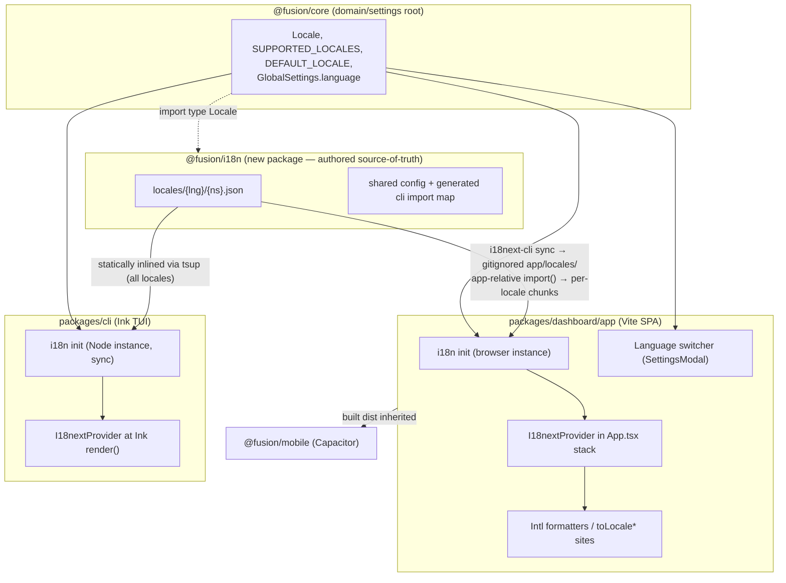
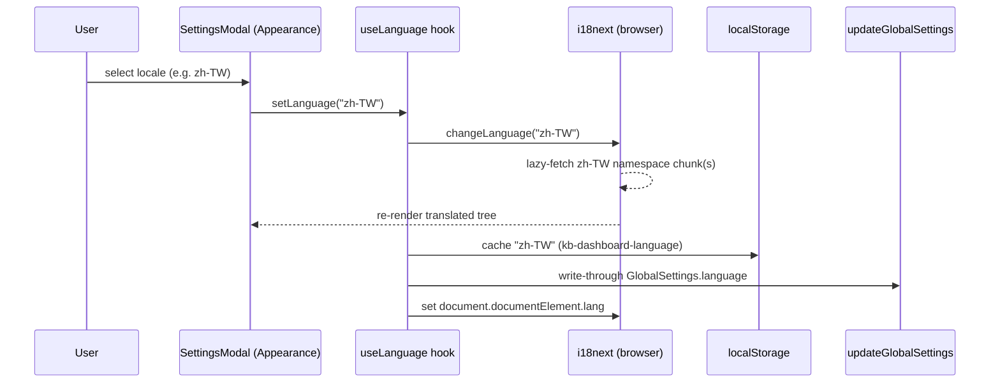
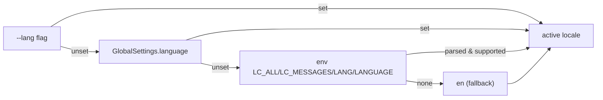

# feat: Add UI localization (i18n) across dashboard and terminal UI

## Summary

Stand up a react-i18next localization foundation that serves both Fusion UI surfaces — the React web dashboard (`packages/dashboard/app`, inherited by the Capacitor mobile wrapper) and the Ink terminal UI (`packages/cli`) — migrate user-facing strings into translation catalogs, ship four non-English locales (`zh-CN`, `zh-TW`, `fr`, `es`) atop an English source-of-truth base, and establish an `i18next-cli`-driven workflow so adding a future language is a near-zero-code, translate-only operation.

---

## Problem Frame

Fusion's UI is currently English-only with strings hardcoded inline across ~464 dashboard `.tsx` files and the Ink TUI components. There is **no i18n library anywhere** in the monorepo (greenfield — confirmed across `packages/` and `plugins/`), and locale-sensitive formatting at ~45 dashboard call sites relies on the implicit browser default (`toLocaleDateString(undefined, …)`), with zero `navigator.language` or `Intl.*` usage.

Fusion's strategy targets a developer audience "across surfaces and machines," and the published CLI (`@runfusion/fusion`) plus the dashboard are the two surfaces users actually read. Supporting Simplified Chinese, Traditional Chinese, French, and Spanish — and lowering the cost of every future language — widens reach without betting the product on any one locale. Because this is greenfield, there is no prior library to reconcile or migrate away from; the cost is entirely in standing up the foundation and the one-time string extraction.

---

## Requirements

### Localization foundation

- R1. A single localization runtime (`react-i18next` + `i18next`) powers both the dashboard and the Ink TUI from one shared catalog source-of-truth, with English as the source language.
- R2. Translation catalogs are organized as `{locale}/{namespace}.json` with nested, ID-style keys (not natural-language keys), split into namespaces so feature areas and the CLI-only surface can be loaded independently.
- R3. Supported locales are a single typed list — `en`, `zh-CN`, `zh-TW`, `fr`, `es` — defined once in `@fusion/core` and consumed by every surface. `en` is the fallback for all.
- R4. Pluralization uses i18next's native CLDR plural categories (via `Intl.PluralRules`); date/number/relative-time formatting uses i18next's built-in `Intl` formatters bound to the active locale. No ICU message format.

### Dashboard (web + mobile)

- R5. The dashboard resolves the active locale at startup with precedence `localStorage → navigator → en`, constrained to `supportedLngs`, and sets `document.documentElement.lang`.
- R6. Only the active locale's catalogs load on first paint; the other four locales are code-split and fetched on demand, consistent with the existing lazy-load/prefetch bundle discipline.
- R7. Users can change language from the Settings UI; the choice persists to `localStorage` and writes through to server-side `GlobalSettings.language`, mirroring the existing theme-preference pattern.
- R8. Locale-sensitive date/number formatting in the dashboard reflects the active i18n locale rather than the implicit browser default.

### Terminal UI (CLI)

- R9. The Ink TUI renders translated strings via the same library, using a separate Node-side i18next instance with statically bundled catalogs and synchronous init (first frame is localized).
- R10. The CLI resolves locale with precedence `--lang flag → persisted GlobalSettings → environment (LC_ALL/LANG/…) → en`.
- R11. CJK and accented text render without breaking the TUI's width-sensitive layouts; single-letter keybinding accelerators are never translated.

### Translations and contributor workflow

- R12. Complete `zh-CN`, `zh-TW`, `fr`, and `es` catalogs are shipped, each independently localized (no auto-conversion between the two Chinese scripts).
- R13. An `i18next-cli` workflow extracts keys from source, syncs missing/orphaned keys across all locales, generates key types, and reports per-locale completion; CI fails on missing keys, stale types, or incomplete catalogs.
- R14. Adding a new language requires no feature code beyond registering the locale code and providing translated catalogs; the procedure is documented for contributors.

---

## Key Technical Decisions

- KTD1. **Library: `react-i18next` + `i18next` v26 for both surfaces.** react-i18next is framework-agnostic and runs in Node, so the same stack powers the Vite SPA and the Ink React tree — no second i18n system. v26's built-in `Intl` formatter is always active and its native pluralization uses CLDR categories, covering our formatting and plural needs without `i18next-icu`. (Note v26 breaking changes: the legacy `interpolation.format` function is removed; `TFunction` imports from `i18next`, not `react-i18next`.)

- KTD2. **Catalogs: `{locale}/{namespace}.json`, nested ID-style keys, multiple namespaces.** Namespaces are i18next's lazy-load unit, so splitting by feature area enables per-surface and per-route code-splitting (a `cli` namespace the web bundle skips; an `errors`/`common`/`app` split for the dashboard). ID-style keys (`settings.appearance.languageLabel`) survive English copy rewrites without orphaning translations — the maintainability the request asks for. English text lives as `defaultValue`/extraction, not as the key.

- KTD3. **Single catalog source-of-truth in a dedicated `@fusion/i18n` package, consumed differently per surface.** Catalogs live in a new `packages/i18n` workspace package (`@fusion/i18n`) — *not* in `@fusion/core`. Putting presentation strings in the domain/settings root would be a layering inversion (core sits under engine and CLI and has no other UI-string responsibility). `@fusion/i18n` owns the authored `locales/{lng}/{ns}.json` source-of-truth, the shared i18next config (namespace list, fallback chain, plural setup), and namespace key types. It `import type`s `Locale` from `@fusion/core` (type-only, no runtime cycle); locale primitives and the persisted `GlobalSettings.language` field stay in core (KTD8). The dashboard lazy-loads the active locale via Vite code-splitting from catalogs generated into its own tree (KTD3a); the CLI statically inlines all catalogs directly from `@fusion/i18n` via tsup (`noExternal: [/^@fusion\//]` already bundles `@fusion/*` from source). Rejected alternatives: catalogs *authored* in `@fusion/core` (layering inversion — the domain root has no UI-string responsibility); catalogs *authored* in `packages/dashboard/app/locales/` and imported across the boundary by the CLI (dependency inversion — terminal UI reaching into the SPA's internals). Note these are distinct from KTD3a's primary wiring, which *generates* catalogs into the dashboard tree from the `@fusion/i18n` source — the dashboard never authors them and the CLI never imports the generated copy. The dashboard's i18n init calls `i18next-resources-to-backend` directly at the (app-relative) call site; no separate factory abstraction is introduced.

- KTD3a. **Dashboard per-locale code-splitting requires a *relative*, package-local dynamic-import template; the authored source-of-truth stays in `@fusion/i18n` and is generated into the dashboard tree at build time.** Vite 6's variable-dynamic-import analysis (via `@rollup/plugin-dynamic-import-vars`) only code-splits `import(\`./locales/${lng}/${ns}.json\`)` when the prefix is relative *to the importing file* and each variable is exactly one path segment. An aliased, bare, or cross-package/workspace specifier in a *variable* `import()` defeats static analysis — Vite eager-bundles with a build warning or fails at runtime — and `import.meta.glob` refuses to cross the `node_modules` boundary. A relative template living inside `@fusion/i18n`'s own source would still resolve through the workspace symlink at the dashboard build; that *can* slip through but is **not a documented guarantee**, and the dashboard has zero existing variable-dynamic-import precedent to lean on. **Decision (primary wiring):** `@fusion/i18n` remains the single authored source-of-truth, but `i18next-cli sync` generates the catalog tree into a gitignored `packages/dashboard/app/locales/` (mirroring the engine `dist` convention — a `predev`/`prebuild` step in the dashboard package), and the dashboard's backend factory imports them with a plainly app-relative `import(\`./locales/${lng}/${ns}.json\`)`. This makes per-locale splitting *guaranteed* rather than dependent on undocumented symlink behavior. The cross-package symlink path (import template inside `@fusion/i18n`, no generation step) is recorded only as an optional optimization to prove out later, not the shipped path. The CLI is unaffected — tsup statically inlines catalogs directly from `@fusion/i18n` across the package boundary (KTD5). U3 keeps a build assertion that per-locale chunks emit, as a regression guard on the generated-catalog wiring.

- KTD4. **Dashboard lazy-loading via `i18next-resources-to-backend` + dynamic `import()`.** Preferred over `i18next-http-backend` for a Vite SPA: hashed assets, offline-capable, no separate static-serving concern. Only the active locale's loaded namespaces touch the main path; switching language fetches the new chunk. Add a `vendor-i18n` `manualChunk` alongside the existing `vendor-react`/`vendor-xterm` splits.

- KTD5. **CLI init is synchronous with statically bundled catalogs (`initImmediate: false`).** Lazy loading is pointless in Node; synchronous init guarantees the first rendered frame is already localized. The CLI gets its own i18next instance (no DOM, no HTTP backend, locale from env/flag/settings — not `localStorage`).

- KTD6. **Tooling: `i18next-cli`, not `i18next-parser`.** `i18next-parser` was archived Feb 2026; `i18next-cli` (SWC-based) unifies `extract`, `sync`, `types`, `status`, and `lint`. Its AST-based `lint` for hardcoded strings is the primary guardrail (CI, warn-first), avoiding a noisy 464-file ESLint sweep. A scoped `eslint-plugin-i18next`/`no-restricted-syntax` rule is deferred (see Scope Boundaries) — the repo's existing `no-restricted-syntax` precedent makes it easy to add later if editor squiggles are wanted.

- KTD7. **zh-CN and zh-TW are fully independent catalogs.** Different script *and* vocabulary — never auto-convert one to the other. Configure script-aware fallback (`zh-Hans→zh-CN`, `zh-Hant→zh-TW`, `zh→zh-CN`, default `en`) and keep `load: 'currentOnly'` so the two never collapse into a generic `zh`. Both have a single CLDR plural category (`other`); French and Spanish carry `one`/`many`/`other`.

- KTD8. **Persisted-locale plumbing extends the existing theme-preference pattern.** Add `language?: Locale` to `GlobalSettings` in core (registered in `DEFAULT_GLOBAL_SETTINGS`, `GLOBAL_SETTINGS_KEYS`, schema/validation). Dashboard persistence mirrors `useTheme.ts`: a `localStorage` cache (using the neighbor-consistent `kb-dashboard-*` key prefix — do **not** pre-empt the kb→fn rename here) plus `updateGlobalSettings` write-through. The CLI reads the same `GlobalSettings.language` server-side.

- KTD9. **Brand tokens stay as interpolation variables in catalogs.** Because the kb→fn rename is in flight, extract product-name occurrences as `{{brand}}`-style variables (or leave brand-only keys untranslated) so the rename can sweep them later without churning all five catalogs.

---

## High-Level Technical Design

### Surface and catalog topology



### Dashboard language-switch flow



### CLI locale resolution precedence



---

## Output Structure

New and notably-modified files (per-unit `Files` sections remain authoritative):

```
packages/
  i18n/                     (new @fusion/i18n package — authored source-of-truth)
    package.json            (source export condition, JSON support)
    locales/                (authored catalogs — translators edit here)
      en/    common.json  app.json  errors.json  cli.json
      zh-CN/ common.json  app.json  errors.json  cli.json
      zh-TW/ ...
      fr/    ...
      es/    ...
    src/
      config.ts             (shared i18next config, namespace + key types)
      cli-catalogs.ts       (generated static import map for the CLI, from SUPPORTED_LOCALES)
      index.ts
  core/
    src/
      types.ts            (+ Locale, SUPPORTED_LOCALES, DEFAULT_LOCALE, GlobalSettings.language)
      settings-schema.ts  (+ language default & key)
      settings-validation.ts
      index.ts            (+ exports)
  dashboard/
    app/
      locales/            (GITIGNORED — generated from @fusion/i18n by i18next-cli sync)
        en/ … zh-CN/ … zh-TW/ … fr/ … es/
      i18n/
        index.ts          (browser init: app-relative resources-to-backend, detector, formatters, fallback)
        useLanguage.ts    (switch + persist hook)
      components/
        LanguageSelector.tsx
    package.json          (predev/prebuild → i18next-cli sync into app/locales)
    vite.config.ts        (vendor-i18n chunk)
  cli/
    src/
      i18n/
        index.ts          (Node sync init, static catalogs, env/flag detection)
i18next.config.ts          (extract/sync/types/status/lint config)
docs/
  i18n-contributing.md     (adding a language)
```

---

## Implementation Units

Phased: **A. Foundation** (U1–U2) → **B. Dashboard** (U3–U5) → **C. Terminal UI** (U6–U7) → **D. Translations & workflow** (U8). Each unit is independently landable.

### U1. Core locale primitives and settings field

- Goal: Define the single source of locale truth and the persisted preference field in `@fusion/core`.
- Requirements: R3, R7 (settings field), R10 (shared field for CLI).
- Dependencies: none.
- Files:
  - `packages/core/src/types.ts` — add `Locale` union, `SUPPORTED_LOCALES` tuple (`["en","zh-CN","zh-TW","fr","es"]`), `DEFAULT_LOCALE`, and `language?: Locale` on `GlobalSettings` (near line 2439, beside `dashboardFontScalePct`). Locale primitives must live in `types.ts` specifically — the dashboard Vite alias resolves `@fusion/core` to `types.ts` only.
  - `packages/core/src/settings-schema.ts` — register `language` in `DEFAULT_GLOBAL_SETTINGS` (line ~18) so it flows into `GLOBAL_SETTINGS_KEYS`.
  - `packages/core/src/settings-validation.ts` — validate `language` against `SUPPORTED_LOCALES`.
  - `packages/core/src/index.ts` — export `Locale`, `SUPPORTED_LOCALES`, `DEFAULT_LOCALE`.
  - `packages/core/src/__tests__/settings-schema.test.ts` (or matching existing settings test) — coverage.
- Approach: Pure type + constant additions; no runtime behavior beyond settings validation. `language` is optional so existing settings files remain valid (absence → resolve at runtime, not persisted default-en, to keep "follow the browser/env" behavior until the user chooses).
- Patterns to follow: `THEME_MODES`/`COLOR_THEMES` const tuples and the `themeMode`/`colorTheme` optional fields; `isGlobalSettingsKey` validation flow.
- Test scenarios:
  - `SUPPORTED_LOCALES` contains exactly the five codes; `DEFAULT_LOCALE` is `en`.
  - `isGlobalSettingsKey("language")` returns true; `language` appears in `GLOBAL_SETTINGS_KEYS`.
  - Validation accepts each supported code and rejects an unsupported code (e.g. `"de"`, `"zh"`).
  - A settings object without `language` round-trips through load/merge unchanged (backward compatibility).
- Verification: `@fusion/core` typechecks and its settings tests pass; the new symbols are importable from the barrel.

### U2. `@fusion/i18n` package, catalog source-of-truth, and i18next-cli tooling

- Goal: Create the `@fusion/i18n` package with shared config and authored `en` base catalogs, the generated CLI import map, and the extract/sync/types/status/lint workflow with a CI gate.
- Requirements: R1 (shared source), R2 (layout/keys/namespaces), R13 (tooling + CI), R14 (drop-in language config).
- Dependencies: U1.
- Files:
  - `packages/i18n/package.json` — new `@fusion/i18n` workspace package; `source` export condition (so the CLI's tsup `conditions: ["source"]` inlines `.ts`/`.json` from source like other `@fusion/*`); JSON import support in its build. Zero runtime internal deps; `import type` only from `@fusion/core` for `Locale`.
  - `packages/i18n/src/config.ts` (shared i18next config: namespace list, script-aware fallback chain, plural setup), `packages/i18n/src/index.ts`.
  - `packages/i18n/src/cli-catalogs.ts` — **generated** static import map (one `import` per `{locale}/{ns}`) produced from `SUPPORTED_LOCALES` by a codegen step, so the CLI's static-bundle path (KTD5) gains a new locale with no hand-edited import block — this is what keeps R14's "near-zero-code" promise true for the terminal surface, not just the dashboard.
  - `packages/i18n/locales/en/{common,app,errors,cli}.json` — initial namespaces (seeded from already-centralized constants like `COLUMN_LABELS`/`COLUMN_DESCRIPTIONS` as the first real keys).
  - `packages/i18n/locales/{zh-CN,zh-TW,fr,es}/*.json` — scaffolded (synced) placeholders so structure exists before U8 fills them.
  - `i18next.config.ts` (repo root) — `defineConfig` with `locales`, `extract.input` globs covering `packages/dashboard/app/**` and `packages/cli/src/**`, `extract.output` → `packages/i18n/locales/{{language}}/{{namespace}}.json`, `types.output`, per-input-tree default-namespace mapping (dashboard globs → `app`/`common`/`errors`; CLI globs → `cli`) so extracted keys land in the right namespace, and `lint` accepted tags/attrs to cut false positives.
  - root `package.json` — scripts: `i18n:extract`, `i18n:sync`, `i18n:types`, `i18n:status`, `i18n:lint`, plus the CLI import-map codegen.
  - `packages/cli/scripts/prepare-publish-manifest.mjs` — add `@fusion/i18n` to the private-dep strip list (alongside the existing `@fusion/core`/`@fusion/engine` handling) so `npm install @runfusion/fusion` does not 404 on the private workspace dep; declare `@fusion/i18n` as a CLI devDependency (inlined via `noExternal`), matching the existing pattern.
  - CI workflow (existing `.github/workflows/*`) — add a job running `extract --ci`, `types --ci`, and `status`. (`lint` runs here too but is the same `i18next-cli lint` named the primary guardrail in KTD6 — not a duplicate ESLint pass.)
  - `.changeset/*.md` — `@runfusion/fusion` minor (published surface gains i18n; `@fusion/i18n` is private/bundled, so no changeset for it per AGENTS.md).
- Approach: `en` is primary; `i18next-cli sync` scaffolds the other four with correct per-locale plural suffixes so contributors never hand-author plural categories. Keep the published-CLI footprint lean (`i18next` + `react-i18next` + `@fusion/i18n` catalogs only; tooling is devDependencies). **CI gate vs. incremental key growth:** because U5/U7 continuously add `en` keys (each re-opening gaps in the four locales), the 100%-completion gate (U8) must not deadlock CI during the migration window. Resolve by having `status` gate at 100% only for a tracked *shipped* set, with newly-added-but-untranslated keys allowed via an explicit pending-keys allowlist (or a per-namespace freeze) until U8 — `extract --ci` (no missing `en` key) and `types --ci` (no stale types) stay hard gates throughout.
- Patterns to follow: existing `@fusion/core` package shape (`source` export condition, tsc build); the engine `dist` gitignored-generated-artifact convention for the dashboard catalog generation (U3); existing root scripts and the docs-sync self-checking test idiom (`app/__tests__/lazy-loaded-views-docs.test.ts`).
- Test scenarios:
  - `i18n:status` exits non-zero when a non-`en` catalog is missing a *shipped* key present in `en`; a key on the pending allowlist does not trip the gate.
  - `i18n:extract --ci` exits non-zero when a `t()` key in source is absent from the `en` catalog.
  - `i18n:sync` adds a newly-introduced `en` key to all four locales and removes an orphaned key from all; a dashboard-namespace key and a `cli`-namespace key route to their correct namespace files.
  - Generated key types include a representative nested key and reject a typo'd key (compile-fail fixture).
  - The generated `cli-catalogs.ts` import map contains exactly one entry per `SUPPORTED_LOCALES × namespace`; regenerating after adding a locale code adds its entries with no hand edit.
  - Covers R13. Covers R14: adding a sixth locale code to `i18next.config.ts` + `SUPPORTED_LOCALES`, then running `sync` + codegen, produces a fully-scaffolded catalog set AND a CLI import map that picks up the locale — no hand-edited feature code on either surface.
- Verification: All `i18n:*` scripts run locally; the CI job is green with `en` populated and the four locales synced (even if untranslated, structure matches); `npm pack` on the CLI produces a manifest with no unresolved `@fusion/*` deps.

### U3. Dashboard i18n runtime

- Goal: Initialize the browser i18next instance with lazy catalog loading, detection, fallback, and Intl formatters; mount the provider.
- Requirements: R1, R4, R5, R6.
- Dependencies: U1, U2.
- Files:
  - `packages/dashboard/app/i18n/index.ts` — init: `initReactI18next`, `i18next-browser-languagedetector` (order `localStorage → navigator → htmlTag`, `supportedLngs`, `caches: ['localStorage']`), `i18next-resources-to-backend` with an **app-relative** `import(\`./locales/${lng}/${ns}.json\`)` over the generated `app/locales/` tree (KTD3a), script-aware `fallbackLng` (KTD7), `load: 'currentOnly'`, and shared config imported from `@fusion/i18n`.
  - `packages/dashboard/package.json` — `predev`/`prebuild` step running `i18next-cli sync` to generate `app/locales/` from the `@fusion/i18n` source (gitignored), mirroring the engine `dist` convention.
  - `packages/dashboard/app/main.tsx` — import the i18n side-effect before `createRoot`; gate first paint on i18next `ready` (Suspense boundary or a top-level loading state) so the UI never renders raw keys during the first catalog fetch (avoids flash-of-untranslated-content); set `document.documentElement.lang` on `languageChanged`.
  - `packages/dashboard/app/App.tsx` — wrap the provider stack (around lines 2044–2058) with `<I18nextProvider>` so toasts/dialogs are translatable.
  - `packages/dashboard/vite.config.ts` — add a `vendor-i18n` `manualChunk` for the `i18next`/`react-i18next` runtime. Note: catalogs are natural async chunks (not `node_modules`), so `manualChunks` needs **no** change to keep them split — record this as an explicit non-change.
  - `packages/dashboard/app/i18n/__tests__/i18n.test.ts` — init/detection/fallback coverage.
  - Build-assertion (the KTD3a verification gate): a check (test or build script) asserting per-locale catalog chunks are emitted to `dist/client/assets` and are NOT folded into the main/entry chunk.
- Approach: The active locale's namespaces load for first paint; other locales become separate chunks fetched on `changeLanguage`. The per-locale `import()` template is **app-relative** over the generated `app/locales/` tree (KTD3a), so Vite static-analyzes and splits it — no dynamic-string specifier or `@vite-ignore` in app code (AGENTS.md), and no dependency on undocumented cross-package symlink resolution. The build assertion is a regression guard that the split actually holds. First paint gates on i18next `ready` so no raw-key flash occurs (the catalog fetch is the only async step before the tree is translatable).
- Patterns to follow: `prefetchLazyViews()` idle-prefetch idiom and `React.lazy("./...")` relative-literal import style in `App.tsx` (the exact shape the locale `import()` mirrors); existing provider-nesting convention (`context/XContext.tsx` + `use*` hook); the engine `dist` gitignored-generated convention for `app/locales/`.
- Test scenarios:
  - With no stored preference and `navigator.language = "fr"`, the resolved locale is `fr`; with `navigator.language = "de"` (unsupported), it falls back to `en`.
  - A stored `localStorage` locale wins over `navigator`.
  - `zh` (generic) resolves to `zh-CN` via fallback; `zh-Hant` resolves to `zh-TW`; `zh-CN` does not collapse to a generic `zh`.
  - Switching to a not-yet-loaded locale triggers exactly one catalog fetch and re-renders translated text.
  - A missing key in `fr` falls back to the `en` value, not the raw key.
  - First paint shows the loading state (not raw keys) until the active catalog resolves.
  - Build assertion: each non-`en` locale produces its own async chunk; the main entry chunk contains no non-`en` catalog payload.
  - Covers R5, R6.
- Verification: Dashboard boots showing the loading state then the resolved locale (no raw-key flash); switching locale at runtime updates rendered strings; the build assertion confirms per-locale chunks exist and the initial chunk carries only the active locale.

### U4. Dashboard language switcher and persistence

- Goal: Let users pick a language in Settings and persist it across reloads and to the server.
- Requirements: R7.
- Dependencies: U3.
- Files:
  - `packages/dashboard/app/hooks/useLanguage.ts` — read/set active locale; `localStorage` cache (`kb-dashboard-language`, neighbor-consistent prefix per KTD8) + `updateGlobalSettings({ language })` write-through; hydrate from `fetchGlobalSettings` on mount.
  - `packages/dashboard/app/components/LanguageSelector.tsx` — option list modeled on `ThemeSelector.tsx` (`{value, label}` with native locale endonyms: 简体中文 / 繁體中文 / Français / Español / English).
  - `packages/dashboard/app/components/SettingsModal.tsx` — render `LanguageSelector` in the Appearance section (case `"appearance"`, line ~3691, beside `ThemeSelector`).
  - `packages/dashboard/app/hooks/__tests__/useLanguage.test.ts`, `packages/dashboard/app/components/__tests__/LanguageSelector.test.tsx` (lands in the `settings-*` test shard).
- Approach: Three-tier persistence exactly as `useTheme.ts`: instant `localStorage` pre-hydration read, server write-through, hydrate-from-server on mount. **Switching applies in place via `changeLanguage` — no full-page reload** (a reload would drop unsaved form state and disrupt in-flight agent views; the sequence diagram reflects this). This requires components to read copy through `useTranslation`/`t()` rather than caching resolved strings outside the React tree, so the re-render propagates. Endonyms are intentionally untranslated (each language names itself). Placement beside `ThemeSelector` in Appearance is the pragmatic home; if Settings grows a General/Preferences section later, language is a content (not visual) preference and would migrate there — noted, not blocking.
- Patterns to follow: `useTheme.ts` (three-tier persistence) and `ThemeSelector.tsx` (switcher UI); Appearance-section rendering in `SettingsModal.tsx`.
- Test scenarios:
  - Selecting a locale calls `changeLanguage`, writes the `localStorage` key, and calls `updateGlobalSettings` once with the new code.
  - Switching language updates rendered copy in place with no `window.location.reload` (assert no reload occurs).
  - On mount, a server `GlobalSettings.language` value hydrates the active locale when no fresher `localStorage` value exists.
  - `localStorage`-unavailable path degrades gracefully (no throw; server write still attempted).
  - Selector shows all five endonyms and marks the active one.
  - Covers R7.
- Verification: Changing language in Settings persists across a reload and is reflected in server settings; mobile (Capacitor) build inherits the switcher with no extra work.

### U5. Dashboard string migration and locale-aware formatting

- Goal: Replace hardcoded user-facing strings with `t()` keys and thread the active locale into date/number formatting — incrementally.
- Requirements: R8, and the dashboard portion of R2 (real keys in catalogs).
- Dependencies: U3, U4.
- Files (incremental — representative, not exhaustive):
  - `packages/core/src/index.ts` consumers of `COLUMN_LABELS`/`COLUMN_DESCRIPTIONS` — route through i18n keys first (already centralized → cheapest win).
  - `packages/dashboard/app/components/SettingsModal.tsx`, `ThemeSelector.tsx`, and Appearance/Settings copy — first migrated view cluster.
  - High-traffic shells: `App.tsx` toast/error strings (e.g. lines ~1036, ~1327), primary navigation and board column UI.
  - The ~45 `toLocale*` call sites (e.g. `ActivityFeed.tsx`, `AgentDetailView.tsx`, `ActivityLogModal.tsx`) — pass the active locale or route through a shared `formatDate`/`formatNumber` helper bound to i18next's Intl formatters.
  - `packages/i18n/locales/en/*.json` — grows with each migrated cluster.
- Approach: **Incremental per-view migration**, starting with already-centralized constants and the Settings surface, then high-traffic views. Do not attempt a big-bang sweep of all 464 files in one unit — land clusters as separate commits under this unit. Keep diffs JSX-surgical (text → `t("key")`); do not disturb component CSS imports. Run `i18n:extract` after each cluster to keep `en` in sync. Brand tokens become `{{brand}}` variables (KTD9).
- Completion criterion (unit exit gate): this unit is done when a **named set of high-traffic/centralized surfaces** — board column UI (`COLUMN_LABELS`/`COLUMN_DESCRIPTIONS`), Settings, primary navigation, and `App.tsx` toast/error strings — are fully migrated and `i18n:status` reports the agreed coverage threshold for that named set. The low-traffic long tail is explicitly out of this unit (Scope Boundaries). Without this gate U5 has no reviewable done state; the threshold is the exit signal, not "all 464 files."
- Execution note: Lead each cluster by adding the keys to the `en` catalog (via `i18n:extract`) and a render test asserting the translated output, then swap the source strings.
- Patterns to follow: existing `useTranslation`-style hook usage; the centralized-constants pattern in core.
- Test scenarios:
  - A migrated component renders the `en` value identical to its prior hardcoded string (no visible regression).
  - The same component renders the `fr` value when locale is `fr` (fixture catalog).
  - A date rendered via the shared helper formats per active locale (`en` vs `fr` vs `zh-CN` differ as expected).
  - A pluralized string (e.g. "N tasks") selects the correct CLDR category in `en`, `fr`, and `zh-CN` (single `other`).
  - A width-constrained component (board column header, sidebar item, badge/chip) with a long translated string (e.g. a ~35% longer `fr`/`de`-shaped fixture) truncates/wraps per its CSS rather than overflowing or breaking layout.
  - Covers R8.
- Verification: Migrated clusters show no English regression in `en`; switching to a populated fixture locale changes the rendered copy and date/number formatting; width-constrained components hold their layout under longer strings; `i18n:status` hits the named-set threshold.

### U6. CLI i18n runtime and CJK-safe rendering

- Goal: Stand up the Node-side i18next instance for the Ink TUI with env/flag detection and width-safe layout.
- Requirements: R9, R10, R11.
- Dependencies: U1, U2.
- Files:
  - `packages/cli/src/i18n/index.ts` — synchronous init (`initImmediate: false`), `initReactI18next`, catalogs from the **generated** `@fusion/i18n` `cli-catalogs.ts` import map (`cli` + shared namespaces; tsup inlines via existing `noExternal: [/^@fusion\//]` + `splitting: false`), `fallbackLng: 'en'`, env detection (`LC_ALL → LC_MESSAGES → LANG → LANGUAGE`). Using the generated map (not a hand-edited import block) is what makes a new locale drop-in here, satisfying R14 on the CLI surface.
  - `packages/cli/src/commands/dashboard-tui/controller.ts` — wrap `DashboardApp` with `<I18nextProvider>` at the `render(...)` call (line 685); resolve locale via precedence flag → `GlobalSettings.language` → env → `en`.
  - `packages/cli/src/bin.ts` and the relevant command(s) — accept a `--lang` flag and pass it into init.
  - Ink width handling: decide between **upgrading `ink` 6.8 → 7.0** (correct CJK double-width measurement built in) or staying on 6.8 with explicit `string-width` math at hand-built layout sites. If upgrading: bump `react`/`@types/react` in `packages/cli/package.json` from `^19.0.0` to `^19.2.0` to match Ink 7's declared peer floor, and add `string-width` only if staying on 6.8. See Risks for the trade-off.
  - `packages/cli/src/i18n/__tests__/i18n.test.ts`, plus a TUI width/snapshot test.
- Execution note: **Spike first** — before committing the runtime, verify `useTranslation` re-renders on `changeLanguage` and `<Trans>` interpolation behave under Ink's custom reconciler (not react-dom). The single-runtime decision (KTD1) assumes this works; there is no cited precedent. If `<Trans>` misbehaves under Ink, prefer plain `t()` calls over `<Trans>` in TUI components (the synchronous `initImmediate: false` init already avoids the Suspense path).
- Approach: Separate instance from the browser (no DOM/HTTP backend). Catalogs bundle into the published binary via tsup; keep them small. Detection precedence is explicit and unit-tested. Never translate single-letter keybinding accelerators (`C`/`V`/`X`/`P`/…) — translate only their labels.
- Patterns to follow: existing Ink render setup in `controller.ts`; existing command/flag parsing in `commands/`.
- Test scenarios:
  - `--lang zh-TW` overrides a conflicting `GlobalSettings.language` and a conflicting `LANG` env value.
  - With no flag and no setting, `LANG=fr_FR.UTF-8` resolves to `fr`; an unsupported `LANG=de_DE` falls back to `en`.
  - First rendered frame is already localized (synchronous init — no English flash).
  - `changeLanguage` under the Ink reconciler re-renders translated labels (validates the single-runtime assumption).
  - A CJK-translated label in a bordered/columnar layout does not misalign borders (width measured as double-width).
  - Keybinding accelerators remain ASCII single letters regardless of locale.
  - Covers R9, R10, R11.
- Verification: `fusion` TUI launches localized per env/flag/settings; CJK labels render without breaking section layouts; a newly-added locale appears in the TUI after regen with no hand-edited CLI source; published CLI dependency footprint stays minimal.

### U7. CLI string migration

- Goal: Migrate Ink TUI user-facing labels into the `cli` (and shared) namespaces.
- Requirements: R12 readiness for the CLI surface; CLI portion of R2.
- Dependencies: U6.
- Files (representative):
  - `packages/cli/src/commands/dashboard-tui/app.tsx` and TUI sub-components — `<Text>` literals → `t()`.
  - `packages/cli/src/commands/dashboard-tui/state.ts` — `SECTION_ORDER`/section labels routed through keys.
  - `packages/cli/src/commands/*.ts` — top-level CLI command output strings (help/status lines) as warranted.
  - `packages/i18n/locales/en/cli.json` — grows with migrated keys.
- Approach: Same JSX-surgical discipline as U5. Translate labels and prose; leave accelerators, file paths, and special-cased QR/SVG payloads untouched. Run `i18n:extract` after each cluster.
- Patterns to follow: U5's migration approach; existing Ink component structure.
- Test scenarios:
  - A migrated TUI screen renders identical `en` output to its prior hardcoded form.
  - The same screen renders translated output under a fixture locale.
  - Width-sensitive sections still align with the longest translated label (CJK fixture).
  - Covers the CLI portion of R2.
- Verification: TUI screens render correctly in `en` and a populated fixture locale; `i18n:status` reflects `cli` namespace coverage.

### U8. Translations and contributor workflow

- Goal: Ship complete `zh-CN`, `zh-TW`, `fr`, `es` catalogs and document the drop-in language process.
- Requirements: R12, R14 (documentation), R13 (status gate enforced full).
- Dependencies: U5, U7 (catalogs must be key-complete before translation).
- Files:
  - `packages/i18n/locales/{zh-CN,zh-TW,fr,es}/*.json` — filled translations (each independently localized; zh-CN and zh-TW never auto-converted).
  - `docs/i18n-contributing.md` — "Adding a language" + "Updating translations" guide: the `i18next.config.ts` + `SUPPORTED_LOCALES` two-line registration, `i18n:sync` to scaffold, translate, `i18n:status` to verify.
  - `docs/contributing.md` and `docs/cli-reference.md` — cross-link the i18n guide; document the `--lang` flag and the Settings language control.
  - CI — flip the `status` gate to require 100% completion for the **shipped key set** per locale; newly-added migration keys land on the pending allowlist (U2) until translated, so adding `en` keys never deadlocks CI mid-migration.
- Approach: Translations may be sourced however the team prefers (in-house, vendor, community) — the unit's engineering deliverable is key-complete, plural-correct, structurally-synced catalogs plus the gate and docs. **Precondition:** because the 100% gate cannot pass without real translations, name the sourcing owner/path before U8 starts; until then the four locales stay on the pending allowlist (not "shipped") so the rest of the plan ships an English-only-but-localization-ready product without a red CI gate. Endonyms and brand `{{brand}}` variables handled per KTD9.
- Patterns to follow: existing `docs/` topical-guide structure.
- Test scenarios:
  - `i18n:status` reports 100% for all four locales (CI gate passes).
  - Each locale loads and renders in the dashboard and TUI without missing-key fallback to `en` for shipped namespaces.
  - French/Spanish plural-bearing keys carry the `one`/`many`/`other` forms; both Chinese carry only `other`.
  - Test expectation for the docs file: none -- documentation only.
  - Covers R12, R14.
- Verification: All four locales render end-to-end on both surfaces; the "add a language" doc walks a contributor from zero to a synced catalog set with no feature-code edits.

---

## Scope Boundaries

In scope: the localization runtime for both surfaces, English extraction of user-facing strings (incremental), the four target locales, locale-aware formatting, persistence, and the contributor workflow.

### Deferred to Follow-Up Work

- A dedicated `eslint-plugin-i18next`/`no-restricted-syntax` editor-time guardrail for hardcoded strings (KTD6 uses `i18next-cli lint` in CI as the primary guard; the ESLint rule is additive polish and noisy across 464 files).
- Migrating the **long tail** of low-traffic dashboard views — U5 establishes the pattern and covers high-traffic/centralized surfaces; remaining views are mechanical follow-ups gated by `i18n:status` rather than blocking this plan.
- Server-side / API error message localization beyond what surfaces in the UI (the Express API in `packages/dashboard/src` is not a user-reading surface).
- RTL language support (Arabic/Hebrew) — none of the target locales are RTL; layout mirroring is out of scope until an RTL locale is requested.
- Switching the persisted-locale `localStorage` key from the `kb-` to `fn-` prefix — owned by the kb→fn rename track, not this plan (KTD8).

### Outside this work

- Translating documentation, marketing, or README content (this is product-UI localization).
- A translation-management SaaS integration (Locize, Crowdin, etc.) — the `i18next-cli` file-based workflow is the chosen path.

---

## Risks & Dependencies

- **Ink 6.8 → 7.0 upgrade for CJK width (U6).** Ink 7.0 measures CJK as double-width (via `string-width`) and fixes column/border alignment, but it also reworked input handling (a major bump needing a TUI regression pass) and raises the React peer floor to 19.2. Mitigation: prefer the upgrade for correctness with the React peer bump (U6); fallback is staying on 6.8 with explicit `string-width` math at hand-built layout sites if the input-handling changes prove disruptive. Decide early in U6; treat as the unit's primary risk.
- **Vite variable dynamic-import code-splitting (KTD3a/U3).** Vite 6 only code-splits a variable `import()` when the prefix is *relative to the importing file*; an aliased, bare, or cross-package specifier defeats `@rollup/plugin-dynamic-import-vars`, and `import.meta.glob` won't cross `node_modules`. The plan resolves this by making the **app-local generated-catalog path primary** (catalogs synced into a gitignored `app/locales/`, imported by a plainly app-relative template) rather than relying on undocumented cross-package symlink resolution. Residual risk: the dashboard has no existing variable-dynamic-import precedent, so U3 keeps a build assertion that per-locale chunks actually emit, as a regression guard before U5 builds on the runtime.
- **react-i18next under the Ink reconciler (KTD1/U6).** The single-runtime decision assumes `useTranslation`/`<Trans>` work under Ink's custom (non-react-dom) reconciler; there is no cited precedent. Mitigation: U6 spikes this before committing the runtime; synchronous `initImmediate: false` init already sidesteps Suspense, and plain `t()` is the fallback if `<Trans>` misbehaves.
- **CLI ships all locales in the published binary.** tsup `splitting: false` + `noExternal` inlines every catalog into `@runfusion/fusion`'s `dist/bin.js`, growing linearly with translation volume and locale count. Mitigation: accepted tradeoff for v1; keep the `cli` namespace separate so dashboard strings aren't dragged in; lazy fs-loading of copied catalog assets is a future optimization if size becomes material.
- **String-extraction surface is large (~464 dashboard files).** Mitigation: incremental per-view migration (U5/U7) with a named-set completion gate, not a big-bang sweep; the plan ships a working foundation + high-traffic coverage and defers the long tail.
- **kb→fn rename collision.** Touching user-facing strings during the in-flight rename risks churn. Mitigation: KTD9 (brand tokens as `{{brand}}` variables) and KTD8 (reuse `kb-` localStorage prefix) keep this plan rename-neutral.
- **Published-package resolution.** `@fusion/i18n` is a private workspace dep inlined into the published CLI; without stripping it from the publish manifest, `npm install @runfusion/fusion` would 404. Mitigation: U2 adds `@fusion/i18n` to `prepare-publish-manifest.mjs` and verifies via `npm pack`; core `i18next` + `react-i18next` only in the CLI runtime, tooling in devDependencies, plus the required changeset.
- **Translation sourcing & quality / zh-CN vs zh-TW.** The two Chinese catalogs must be independently localized; auto-conversion produces unnatural text (KTD7). The 100% CI gate cannot pass without real translations and every migrated `en` key re-opens locale gaps — mitigated by the pending-keys allowlist (U2/U8) and by naming a sourcing owner before U8 starts. Dependency: actual translation sourcing (process, not engineering).

---

## Sources / Research

- i18next v26 (built-in Intl formatter always active; legacy `interpolation.format` removed; `TFunction` from `i18next`) — i18next migration guide & TypeScript docs.
- `i18next-cli` (SWC-based extract/sync/types/status/lint) replaces the archived `i18next-parser` (archived Feb 2026) — i18next-cli GitHub.
- Lazy catalogs via `i18next-resources-to-backend` + Vite dynamic import — i18next "add or load translations"; lazy-loading guidance.
- Script-aware Chinese fallback + `load: 'currentOnly'` for zh-CN/zh-TW separation — i18next fallback principles, issue #1467.
- Ink 7.0 CJK/`string-width` rendering fixes — Ink GitHub; Ink 7.0 release writeup.
- Env-based CLI detection (`LC_ALL/LANG/…`) — `i18next-cli-language-detector`.
- Vite 6 variable-dynamic-import code-splitting rules (relative-prefix requirement, one `*` per segment, no alias/bare/node_modules resolution via `@rollup/plugin-dynamic-import-vars`; `import.meta.glob` cross-package limitation) — Vite Features docs; `vitejs/vite` issues #2390, #5728, #12180; `i18next-resources-to-backend` recommended loader shape (i18next docs). Drives KTD3a and the U3 build-assertion gate.
- `@fusion/i18n` as the catalog home (vs. `@fusion/core` layering inversion, vs. dashboard-app-tree dependency inversion) — repo seams: dashboard `@fusion/core` type-only alias `packages/dashboard/vite.config.ts:124`; CLI `noExternal: [/^@fusion\//]` + `splitting:false` + `conditions:["source"]` in `packages/cli/tsup.config.ts`; core `files:["dist","README.md"]` in `packages/core/package.json`.
- Repo seams: provider stack `packages/dashboard/app/App.tsx:2044`; settings `packages/core/src/types.ts:2433`, `packages/core/src/settings-schema.ts:18`; theme-persistence pattern `packages/dashboard/app/hooks/useTheme.ts`; Settings Appearance `packages/dashboard/app/components/SettingsModal.tsx:3691`; Ink mount `packages/cli/src/commands/dashboard-tui/controller.ts:685`; ESLint `no-restricted-syntax` precedent `eslint.config.mjs`; AGENTS.md changeset (published-only) and static-import rules.
