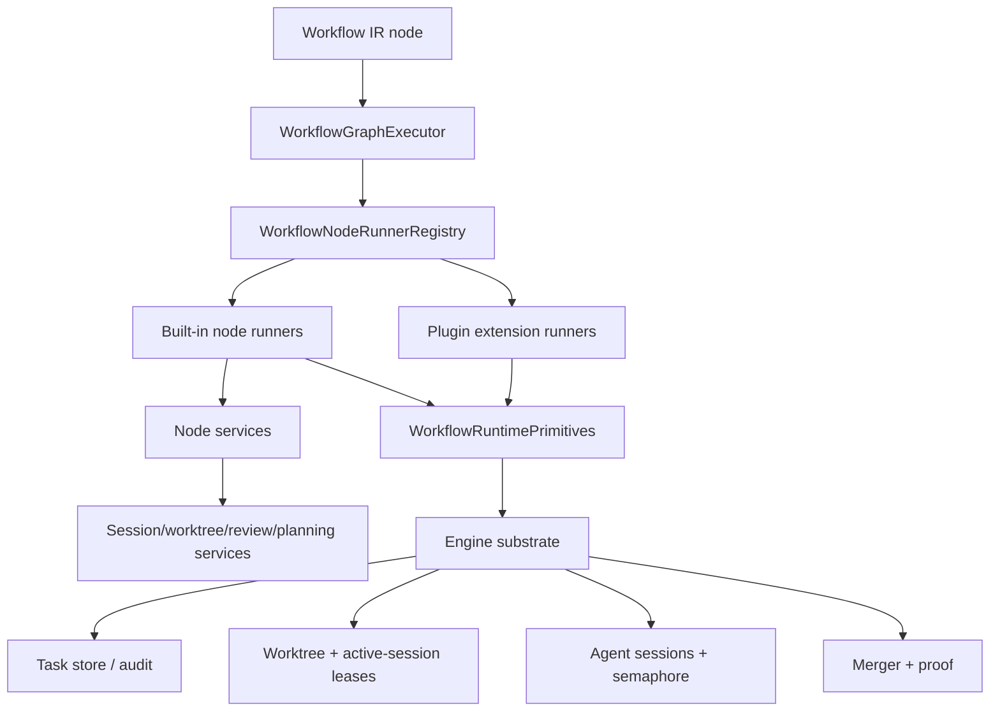
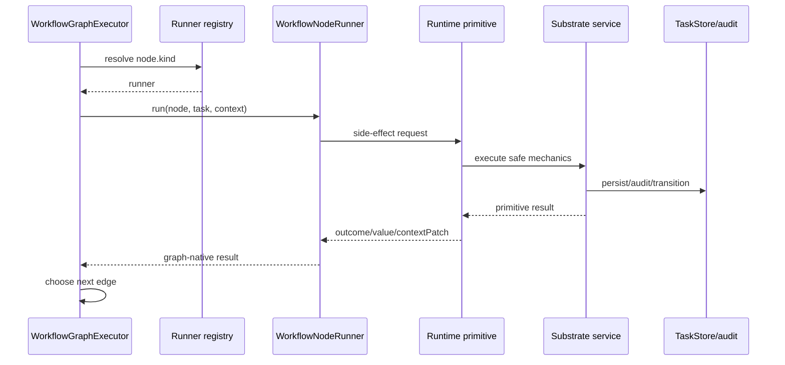

# Refactor Workflow Node Runner Classes Plan

## Goal Capsule

| Field | Value |
|---|---|
| Objective | Refactor workflow lifecycle logic out of monolithic triage, executor, and reviewer files into well-defined workflow node runner modules/classes that call runtime primitives through explicit dependencies. |
| Authority | Architecture decision: decouple workflow node behavior from monolithic triage/executor/reviewer files into workflow-owned node runners and runtime primitive/service boundaries while engine substrate keeps hard safety invariants. |
| Execution profile | Deep architecture refactor across `@fusion/engine` workflow dispatch, runtime primitive adapters, custom node execution, reviewer invocation, triage planning review, and focused parity tests. |
| Stop conditions | Do not change workflow behavior while extracting boundaries. Do not weaken worktree, file-scope, merge-proof, pause/abort, semaphore, active-session, or self-healing invariants. Do not add arbitrary workflow-definition code execution. |
| Tail ownership | Ship in small slices with characterization tests first. Add a changeset only when behavior of published `@runfusion/fusion` changes; pure internal refactor slices do not need one. |

---

## Product Contract

### Summary

Fusion already has workflow IR, a `WorkflowGraphExecutor`, a `WorkflowTaskRuntime`, and a `WorkflowRuntimePrimitives` boundary.
The remaining pain is that major lifecycle mechanics still live in large imperative files: `executor.ts` owns primitive implementations, custom node execution, task-done/review tools, session setup, worktree handling, and many recovery hooks; `triage.ts` still owns planning-session and plan-review behavior; `reviewer.ts` exposes one large review function used from both executor and triage.

The target is a node-runner architecture, not workflow-authored arbitrary code blocks.
Workflow definitions remain declarative.
Engine-owned node runner modules/classes implement node behavior with typed dependencies, call runtime primitives or narrow substrate services, and return graph-native outcomes.
`WorkflowGraphExecutor` should walk and route the graph; node runners should own node-kind behavior; `TaskExecutor`, `TriageProcessor`, and `reviewStep` should shrink into substrate adapters and session services.

### Problem Frame

`packages/engine/src/executor.ts` is over 17k lines and currently acts as task orchestrator, primitive provider, custom workflow node runner, tool factory, worktree/session manager, review bridge, merge boundary, and recovery participant.
That coupling makes workflow behavior hard to reason about because a graph node can still delegate into hidden executor branches, while tests often call private executor methods directly.
The repo's current concepts and docs already define a cleaner split: workflow policy in IR/node routing, runtime primitives as the side-effect boundary, and engine substrate for safety, scheduling, persistence, process supervision, and audit.

### Requirements

- R1. Workflow node behavior currently implemented through `createDefaultNodeHandlers`, `runGraphCustomNode`, `createAuthoritativeWorkflowPrimitives`, triage planning paths, and reviewer calls must move toward explicit node runner modules/classes with narrow dependencies.
- R2. `WorkflowGraphExecutor` must remain a graph walker and outcome router, not a holder of side-effecting lifecycle logic.
- R3. Workflow definitions must stay declarative; the refactor must not introduce user-authored arbitrary code blocks inside workflow IR.
- R4. Existing workflow behavior must be preserved during extraction, including built-in coding, stepwise coding, custom prompt/script/gate nodes, optional groups, parse-steps, code nodes, notify nodes, PR nodes, merge nodes, and fast-mode behavior.
- R5. Safety invariants remain substrate-owned: worktree acquisition and ownership, active-session leases, file-scope checks, branch/merge proof, process supervision, semaphores, task transition validation, pause/abort semantics, and recovery gates.
- R6. Node runner dependencies must make side effects explicit and testable without instantiating full `TaskExecutor` when a narrower fake can prove behavior.
- R7. Legacy seams and private executor test paths should be retired incrementally only after parity tests cover the equivalent runner path.
- R8. Planning/triage and review behavior should expose node-compatible services so plan, plan-review, review, and step-review nodes do not have to reach into triage or reviewer monoliths.
- R9. The refactor must support plugin-contributed workflow node handlers and existing workflow extensions without forcing plugins to import executor internals.
- R10. Documentation and concepts must stay aligned so future work understands where to add a workflow behavior: IR, runner, primitive adapter, or substrate service.

### Scope Boundaries

In scope:

- Engine-local node runner interface and registry.
- Migration of existing function handlers into runner modules/classes.
- Extraction of runtime primitive adapter creation out of `TaskExecutor` into narrower provider modules.
- Extraction of custom prompt/script/gate node execution out of `TaskExecutor.runGraphCustomNode`.
- Review and planning service seams needed by review/plan nodes.
- Characterization and parity tests for the runner registry, primitive adapters, custom-node execution, review invocation, and workflow graph behavior.
- Updates to workflow runtime docs and concepts.

Out of scope:

- Changing workflow IR schema for arbitrary user code blocks.
- Rewriting scheduler, merger, task store, self-healing, or dashboard workflow editor wholesale.
- Removing `TaskExecutor`, `TriageProcessor`, or `reviewStep` in one pass.
- Broad behavior changes already covered by `docs/plans/2026-06-29-002-workflow-node-lifecycle-authority-plan.md`.
- Moving hard invariants into workflow definitions or plugin code.

### Acceptance Examples

- AE1. Given a built-in coding workflow reaches `execute`, the graph invokes an execute node runner that uses runtime primitives and preserves current worktree/session/task-done behavior.
- AE2. Given a custom prompt/script/gate node, the graph invokes a custom node runner service rather than a private `TaskExecutor.runGraphCustomNode` method, while preserving model, agent, skill, CLI, `cli-agent`, await-input, fast-mode, column-agent, approval, and write-capable worktree behavior.
- AE3. Given a step-review node in a foreach template, the runner calls a review service through explicit dependencies and preserves advisory/single-writer, workspace per-repo review, unavailable retry, and verdict routing.
- AE4. Given existing tests that instantiate `WorkflowGraphExecutor` with fake primitives, runner dispatch remains unit-testable without a full executor.
- AE5. Given a plugin-contributed workflow extension, plugin node handling remains opt-in through registry/extension wiring and does not depend on executor private methods.
- AE6. Given a paused, aborted, or restarted workflow run, node runner extraction does not change re-entry, retry budget, task status, or run-audit behavior.
- AE7. Given old legacy seam tests, either they remain on an explicit compatibility adapter or are replaced by runner/primitive parity tests that prove the same outcomes.

---

## Planning Contract

### Key Technical Decisions

- KTD-1. Introduce an engine-owned `WorkflowNodeRunner` contract before moving behavior.
  The first slice should add a runner interface and registry that adapts to the existing `WorkflowNodeHandler` shape.
  This avoids a big-bang rewrite and lets each node kind migrate independently.

- KTD-2. Keep runtime primitives as the node side-effect boundary.
  Node runners should call `WorkflowRuntimePrimitives` or narrow injected services, not broad `TaskExecutor` methods.
  Existing primitive names are the compatibility contract for planning, coding sessions, task-step execution, review, transition, merge, artifact I/O, and audit.

- KTD-3. Treat `TaskExecutor` as an adapter provider during migration.
  `TaskExecutor.createAuthoritativeWorkflowPrimitives` and `runGraphCustomNode` should be split into factory/service modules, but the first passes can delegate through `TaskExecutor` to preserve behavior.
  Delete private executor entry points only after equivalent tests exist on the new services.

- KTD-4. Custom node execution deserves its own service before class-by-class migration.
  Custom prompt/script/gate nodes carry the most executor-specific behavior: executor mode, model/agent/skill/CLI/CLI-agent resolution, column-agent adoption, fast mode, write-capable worktree guards, await-input, approval pause, task documents, artifacts, and workflow tool exposure.
  Extracting that as `WorkflowCustomNodeExecutionService` creates a real seam without scattering behavior across many node classes.

- KTD-5. Review and planning need service seams, not direct monolith imports.
  `reviewStep` can remain the low-level reviewer implementation initially, but runners should depend on a `WorkflowReviewService`.
  Triage planning and plan-review paths should similarly expose a `WorkflowPlanningService` or primitive adapter so plan nodes do not reach into `TriageProcessor` internals.

- KTD-6. Runner registry must preserve plugin and extension order.
  Built-in runners should be registered by kind, then plugin/extension handlers can override or add only where currently allowed.
  Missing dependencies must continue failing closed with clear outcome values instead of silently passing.

- KTD-7. Use characterization-first sequencing for monolith extraction.
  Before moving each behavior out of `executor.ts`, add or relocate tests that assert current outcomes through graph/runtime public seams.
  Avoid private-method tests as the final proof; they are acceptable only as temporary characterization while the extraction is underway.

### High-Level Technical Design

### Target Module Shape

The exact file layout can adjust during implementation, but the plan assumes these ownership boundaries:

- `packages/engine/src/workflow-node-runner.ts` defines the runner contract, runner context, registry, and compatibility adapter to `WorkflowNodeHandler`.
- `packages/engine/src/workflow-node-runners/` holds built-in runner modules by domain: prompt/script/gate, step review, parse steps, code, notify, merge, PR, and optional group/loop adapters when useful.
- `packages/engine/src/workflow-runtime-primitive-provider.ts` or equivalent holds the factory that currently lives in `TaskExecutor.createAuthoritativeWorkflowPrimitives`.
- `packages/engine/src/workflow-custom-node-execution.ts` owns the behavior currently concentrated in `TaskExecutor.runGraphCustomNode`.
- `packages/engine/src/workflow-review-service.ts` wraps `reviewStep` and workspace/per-step invocation details.
- `packages/engine/src/workflow-planning-service.ts` wraps plan and plan-review behavior that currently lives in `TriageProcessor`.

### Sequencing

1. Add the runner interface/registry and adapt existing handlers with no behavior change.
2. Move pure or nearly pure handlers first: notify, code, parse-steps, gate, merge gate/backoff/manual hold.
3. Extract primitive provider and migrate primitive-backed prompt/script/review/merge runners.
4. Extract custom node execution service and migrate custom prompt/script/gate behavior.
5. Extract review service and connect step-review/review runners.
6. Extract planning service and connect planning/plan-review nodes.
7. Remove legacy seam/default-handler compatibility where production no longer needs it.
8. Update docs, concepts, and tests after each behavior-bearing slice.

### Assumptions

- The plan is a focused follow-up, not a replacement for `docs/plans/2026-06-29-002-workflow-node-lifecycle-authority-plan.md`.
- No database migration is expected for the first runner extraction slices.
- Existing workflow IDs, node IDs, and IR shapes remain stable.
- The first implementation can use class instances or object modules as long as the public contract is a well-defined `WorkflowNodeRunner`; the goal is clear ownership and dependency shape, not object-oriented ceremony.
- External research is not load-bearing because this is an internal refactor following existing repo architecture and concepts.

### Alternative Approaches Considered

- **Keep function handlers and only split files.**
  This would reduce file size but preserve the same dependency ambiguity: handlers would still mix graph behavior, primitive dispatch, custom execution, and compatibility seams without a contract that plugin runners or tests can target.

- **Big-bang rewrite of `TaskExecutor`, `TriageProcessor`, and `reviewStep`.**
  This would produce the cleanest end state on paper but carries too much behavioral risk across worktree, pause, review, merge, and recovery invariants.
  The plan chooses adapters and characterization-first migration instead.

- **Allow workflow definitions to contain independent code blocks.**
  This was rejected because it moves trust, safety, and process supervision problems into workflow authoring.
  Fusion workflows should stay declarative; engine-owned runners execute known node kinds behind safety boundaries.

---

## Implementation Units

### U1. Add the node runner contract and compatibility registry

- **Goal:** Introduce a typed runner interface and registry that can resolve node kinds and adapt runners to the existing `WorkflowNodeHandler` call shape without changing behavior.
- **Requirements:** R1, R2, R3, R6, R7, R9
- **Dependencies:** None
- **Files:**
  - `packages/engine/src/workflow-node-runner.ts` (new)
  - `packages/engine/src/workflow-graph-executor.ts`
  - `packages/engine/src/workflow-node-handlers.ts`
  - `packages/engine/src/__tests__/workflow-node-runner.test.ts` (new)
  - `packages/engine/src/__tests__/workflow-graph-executor-handlers.test.ts`
- **Approach:** Define `WorkflowNodeRunner`, `WorkflowNodeRunnerContext`, and `WorkflowNodeRunnerRegistry`.
  The registry should support built-in runners, dependency validation, and handler adaptation.
  Initially register adapters around `createDefaultNodeHandlers` so all existing tests and runtime paths continue to see the same handler behavior.
  The graph executor should accept either handlers or a registry during migration, with explicit precedence documented in code.
- **Patterns to follow:** `createDefaultNodeHandlers` fail-closed behavior in `packages/engine/src/workflow-node-handlers.ts`; plugin extension registry patterns in `packages/core/src/workflow-extension-registry.ts`; existing graph executor dependency injection.
- **Test scenarios:**
  - A registered runner for `notify` receives the same node/task/context shape as a handler and its result routes through the graph.
  - An unknown non-start/end node kind still fails with the existing "no handler" behavior.
  - Explicit handler overrides continue to work while the registry is present.
  - Missing runner dependencies fail closed instead of succeeding.
  - Plugin/extension runner registration order is deterministic and cannot accidentally override built-ins unless the existing extension contract allows it.
- **Verification:** The runner registry can be used in a graph executor unit test without constructing `TaskExecutor`.

### U2. Move pure and low-side-effect built-in handlers into runner modules

- **Goal:** Prove the runner pattern by migrating small handlers out of the monolithic handler factory while keeping their behavior byte-equivalent.
- **Requirements:** R1, R2, R4, R6, R7
- **Dependencies:** U1
- **Files:**
  - `packages/engine/src/workflow-node-runners/gate-runner.ts` (new)
  - `packages/engine/src/workflow-node-runners/notify-runner.ts` (new)
  - `packages/engine/src/workflow-node-runners/code-runner.ts` (new)
  - `packages/engine/src/workflow-node-runners/parse-steps-runner.ts` (new)
  - `packages/engine/src/workflow-node-handlers.ts`
  - `packages/engine/src/__tests__/workflow-node-handlers.test.ts`
  - `packages/engine/src/__tests__/workflow-node-handlers-notify.test.ts`
  - `packages/engine/src/__tests__/code-node.test.ts`
  - `packages/engine/src/__tests__/workflow-parse-steps.test.ts`
- **Approach:** Move `gate`, `notify`, `code`, and `parse-steps` behavior into runner modules and have `createDefaultNodeHandlers` adapt those runners during the transition.
  Preserve existing fail-closed sentinel values such as `parse-steps-unwired`, `notify-skipped`, and code-runner failure outputs.
  Keep executable gates routed through the custom-node service hook until U5 extracts that service.
- **Patterns to follow:** Existing `createGateHandler`, `createNotifyHandler`, `createCodeNodeHandler`, and `createParseStepsHandler` behavior.
- **Test scenarios:**
  - Context gates pass and fail on the same `contextKey`/`expect` combinations as before.
  - Executable gate without a custom-node runner fails closed.
  - `notify` with no dispatch dependency succeeds as skipped and does not fail the workflow.
  - `parse-steps` without deps fails with the current unwired value.
  - Code node runner preserves compile/execute success and failure behavior.
- **Verification:** Existing focused node-handler tests pass after imports move to runner modules.

### U3. Extract the workflow runtime primitive provider from TaskExecutor

- **Goal:** Move the factory currently in `TaskExecutor.createAuthoritativeWorkflowPrimitives` into a dedicated provider module with explicit substrate dependencies.
- **Requirements:** R1, R2, R5, R6, R7
- **Dependencies:** U1
- **Files:**
  - `packages/engine/src/workflow-runtime-primitive-provider.ts` (new)
  - `packages/engine/src/runtime-primitives.ts`
  - `packages/engine/src/executor.ts`
  - `packages/engine/src/workflow-authoritative-driver.ts`
  - `packages/engine/src/__tests__/runtime-primitives.test.ts`
  - `packages/engine/src/__tests__/executor-fast-mode-workflows.test.ts`
  - `packages/engine/src/__tests__/workflow-task-runtime.test.ts`
- **Approach:** Introduce a provider that receives the narrow dependencies needed for primitives: store access, run context lookup, worktree/session execution callbacks, merge requester, settings, audit/log hooks, and recovery context.
  Keep `TaskExecutor.createAuthoritativeWorkflowPrimitives` as a compatibility wrapper that delegates to the provider.
  Do not move implementation behavior and change semantics in the same commit; first preserve output shapes and audit values.
- **Patterns to follow:** `WorkflowRuntimePrimitives` in `packages/engine/src/runtime-primitives.ts`; documented workflow-native primitive split in `docs/solutions/architecture-patterns/workflow-native-runtime-primitives.md`.
- **Test scenarios:**
  - Provider-created primitives produce the same planning, execute, review, transition, merge, artifact, and audit results as the existing executor factory for representative fake dependencies.
  - `prepareWorktree` still tolerates older/minimal stores and does not acquire a second worktree.
  - `runCodingSession` preserves `implementation-paused` and `implementation-incomplete` values.
  - `requestMerge` still blocks incomplete implementation steps before invoking the merge requester.
  - `transitionTask` still uses move semantics when available so notifications fire.
- **Verification:** `WorkflowTaskRuntime` can run with primitives created outside a full executor instance in a focused test.

### U4. Convert primitive-backed prompt/script/review/merge behavior into runners

- **Goal:** Replace the prompt-like primitive handler branch with node runners for seam-backed prompt/script nodes and merge-attempt nodes.
- **Requirements:** R1, R2, R4, R5, R6, R7
- **Dependencies:** U1, U3
- **Files:**
  - `packages/engine/src/workflow-node-runners/prompt-seam-runner.ts` (new)
  - `packages/engine/src/workflow-node-runners/merge-runner.ts` (new)
  - `packages/engine/src/workflow-node-handlers.ts`
  - `packages/engine/src/workflow-merge-nodes.ts`
  - `packages/engine/src/__tests__/workflow-graph-executor-handlers.test.ts`
  - `packages/engine/src/__tests__/workflow-merge-nodes.test.ts`
  - `packages/engine/src/__tests__/workflow-graph-executor-retry-coding-workflow.test.ts`
- **Approach:** Move seam resolution and primitive dispatch into runner modules.
  The runner should still stamp `workflow:seam-governing-node-id`, handle `step-execute` foreach context, map primitive outcomes to graph outcomes, and preserve context patching for modified files, summaries, and worktree path.
  Keep legacy seam adapters in a clearly named compatibility runner only for tests or transitional callers.
- **Patterns to follow:** `createPrimitivePromptLikeHandler`, `createPrimitiveStepReviewHandler`, and `runWorkflowMergeAttemptNode`.
- **Test scenarios:**
  - Planning seam calls `runPlanningSession` once and forwards outcome/value/context patch.
  - Execute seam calls `prepareWorktree` before `runCodingSession` and does not run coding when preparation fails.
  - Execute seam includes worktree path and modified file/summary context patches as today.
  - Review seam calls `runReview` with code review input and preserves `in-review` value.
  - Merge attempt runner preserves merge success, manual-required, transient failure, timeout, and failure values.
  - Legacy seam compatibility still works only when explicitly selected.
- **Verification:** Built-in coding graph parity tests still visit the same logical node IDs and outcomes.

### U5. Extract custom prompt/script/gate node execution from TaskExecutor

- **Goal:** Replace `TaskExecutor.runGraphCustomNode` with a dedicated custom node execution service consumed by runners and plugin hooks.
- **Requirements:** R1, R4, R5, R6, R7, R9
- **Dependencies:** U1, U2, U3
- **Files:**
  - `packages/engine/src/workflow-custom-node-execution.ts` (new)
  - `packages/engine/src/workflow-node-runners/custom-node-runner.ts` (new)
  - `packages/engine/src/executor.ts`
  - `packages/engine/src/plugin-runner.ts`
  - `packages/engine/src/__tests__/executor-column-agent-custom-node.test.ts`
  - `packages/engine/src/__tests__/executor-fast-mode-workflows.test.ts`
  - `packages/engine/src/__tests__/executor-browser-verification.test.ts`
  - `packages/engine/src/__tests__/workflow-step-integration-cwd.test.ts`
  - `packages/engine/src/__tests__/ce-workflow-step-conventions.test.ts`
- **Approach:** Create a service that owns custom node execution inputs and outputs.
  Its dependencies should include store, root/workspace context, settings, agent store, message store, skill resolver/session helpers, command runner, approval helpers, column-agent resolver, and task document/artifact tool factories.
  `TaskExecutor.runGraphCustomNode` becomes a temporary wrapper around the service and is then deleted once callers use the service directly.
  Preserve all executor kinds and guardrails: `model`, `agent`, `skill`, `cli`, `cli-agent`, await-input, skill await-input sentinel, fast-mode skip, raw CLI approval, column-agent adoption, write-capable worktree guard, workflow tool exposure, and workspace cwd handling.
- **Patterns to follow:** Current `runGraphCustomNode` behavior; `createWorkflowAuthoringTools` approval-stripping behavior; column-agent tests.
- **Test scenarios:**
  - Model custom node synthesizes a workflow step and returns the same verdict parsing/output behavior.
  - Agent custom node adopts agent model/persona and missing agent falls back as today.
  - Skill node requests both namespaced and bare skill names and preserves workflow-step conventions.
  - Raw CLI node requires approval unless bypass flags are present from trusted executor lane.
  - `cli-agent` node routes through the existing task-session orchestration.
  - Write-capable custom node without a worktree fails with `no-worktree-for-write-node`.
  - Fast-mode skips custom prompt/script/gate nodes but still enforces await-input and implementation CLI-agent nodes.
  - Column-agent override/defer precedence remains unchanged.
- **Verification:** No production caller needs to invoke a private executor method to run a custom workflow node.

### U6. Extract workflow review service and migrate review runners

- **Goal:** Make review-capable nodes depend on a review service rather than direct calls into `reviewer.ts` or executor review tool factories.
- **Requirements:** R1, R4, R5, R6, R7, R8
- **Dependencies:** U1, U3, U4
- **Files:**
  - `packages/engine/src/workflow-review-service.ts` (new)
  - `packages/engine/src/reviewer.ts`
  - `packages/engine/src/executor.ts`
  - `packages/engine/src/workflow-node-runners/step-review-runner.ts`
  - `packages/engine/src/__tests__/reviewer.test.ts`
  - `packages/engine/src/__tests__/reviewer-workspace.test.ts`
  - `packages/engine/src/__tests__/workflow-step-review.test.ts`
  - `packages/engine/src/__tests__/workflow-graph-step-rerun.test.ts`
- **Approach:** Wrap `reviewStep` behind a service that accepts workflow context, review type, step identity, workspace worktree set, advisory flag, baseline/checkpoint context, settings, and logging callbacks.
  The first implementation can delegate to `reviewStep`; the important extraction is that workflow runners no longer need executor-specific review wrappers.
  Preserve workspace behavior where callers loop per acquired sub-repo and aggregate verdicts as a conjunction.
- **Patterns to follow:** Current `createReviewStepTool`, `createAuthoritativeWorkflowSeams().stepReview`, `reviewer-workspace` tests, and reviewer unavailable retry contract.
- **Test scenarios:**
  - Step-review runner routes APPROVE, REVISE, RETHINK, and UNAVAILABLE to the same graph values as before.
  - Advisory split-branch review records verdict context but does not authoritatively mark the step done.
  - Workspace task review invokes one review per acquired repo and aggregates as today.
  - Pause/global-pause returns UNAVAILABLE without spawning a reviewer.
  - Fallback model and stricter retry behavior remain in `reviewStep` or service tests.
- **Verification:** Step-review and `fn_review_step` surfaces share the same review service behavior.

### U7. Extract workflow planning service and connect planning nodes

- **Goal:** Create a planning service seam so plan/planning/plan-review nodes do not depend on `TriageProcessor` internals.
- **Requirements:** R1, R4, R5, R6, R7, R8
- **Dependencies:** U1, U3, U4, U6
- **Files:**
  - `packages/engine/src/workflow-planning-service.ts` (new)
  - `packages/engine/src/triage.ts`
  - `packages/engine/src/triage-preflight.ts`
  - `packages/engine/src/workflow-node-runners/planning-runner.ts` (new)
  - `packages/engine/src/__tests__/triage.test.ts`
  - `packages/engine/src/__tests__/triage-plan-review-unavailable-retry.test.ts`
  - `packages/engine/src/__tests__/triage-planning-prompt-single-source.test.ts`
  - `packages/engine/src/__tests__/workflow-task-runtime.test.ts`
- **Approach:** Extract the behavior needed by workflow planning nodes: prompt seed selection, task document read/write, workflow selection tools, memory/research tools, user comments, plan review retry/unavailable handling, and transition from planning to workflow execution.
  `TriageProcessor` remains the scheduler-facing owner for picking triage tasks, but node execution should call the planning service through primitives or runners.
  Preserve plan-review-unavailable retry behavior: rerun review/finalization against the existing prompt without cold-starting planning.
- **Patterns to follow:** `TriageProcessor` planning session setup, `buildSpecificationPrompt`, plan-review retry tests, and workflow selection routing docs.
- **Test scenarios:**
  - Planning node writes or preserves `PROMPT.md` exactly as current triage planning does for a normal task.
  - Existing non-empty draft is used for replan/retry instead of cold-starting.
  - Plan review UNAVAILABLE parks with the current retry state and reruns only review/finalization after backoff.
  - Plan review REVISE routes to replan and does not start execution.
  - Workflow selection rules remain unchanged: agents do not reroute current executor tasks without explicit user request.
- **Verification:** Triage tests prove scheduler-facing selection still works while workflow runtime tests can exercise planning through the service.

### U8. Retire legacy seam and private-method test paths where parity exists

- **Goal:** Remove or quarantine compatibility paths that keep production workflow execution coupled to monolithic executor internals after runner parity is proven.
- **Requirements:** R1, R2, R4, R7, R9, R10
- **Dependencies:** U2, U3, U4, U5, U6, U7
- **Files:**
  - `packages/engine/src/workflow-node-handlers.ts`
  - `packages/engine/src/workflow-authoritative-driver.ts`
  - `packages/engine/src/executor.ts`
  - `packages/engine/src/workflow-task-runtime.ts`
  - `packages/engine/src/__tests__/workflow-graph-executor-parity.test.ts`
  - `packages/engine/src/__tests__/workflow-node-handlers.test.ts`
  - `packages/engine/src/__tests__/executor-fast-mode-workflows.test.ts`
- **Approach:** Once runner and service tests cover the behavior, remove production reliance on `WorkflowLegacySeams` and private executor methods.
  Keep an explicitly named compatibility adapter only for old tests or old runtime entry points that cannot yet be migrated.
  Replace private-method tests with graph/runtime tests or service tests where possible.
- **Patterns to follow:** Existing fail-closed compatibility posture and workflow-native cutover docs.
- **Test scenarios:**
  - Production authoritative workflow execution does not construct legacy seams.
  - Tests that need old minimal fakes must opt into the compatibility adapter explicitly.
  - Built-in workflow parity tests still pass for default coding, stepwise coding, quick fix, review-heavy, marketing, design, lead generation, and compound engineering where plugin-gated.
  - Custom workflow prompt/script/gate parity remains intact through runner/service paths.
- **Verification:** Grepping production workflow runtime paths shows no dependency on `createAuthoritativeWorkflowSeams` except compatibility tests or adapters.

### U9. Update documentation, concepts, and release metadata

- **Goal:** Make the new node runner boundary discoverable for future implementers and operators.
- **Requirements:** R3, R9, R10
- **Dependencies:** U1-U8 as applicable
- **Files:**
  - `docs/workflow-steps.md`
  - `docs/architecture.md`
  - `CONCEPTS.md`
  - `docs/solutions/architecture-patterns/workflow-native-runtime-primitives.md`
  - `.changeset/*.md` when behavior changes published `@runfusion/fusion`
  - `packages/cli/src/__tests__/workflow-docs-current.test.ts`
- **Approach:** Document the four-way split: workflow IR policy, node runners, runtime primitives, and engine substrate.
  Update concepts only for durable vocabulary such as Workflow Node Runner or Node Runner Registry.
  Add a changeset only for user-visible behavior changes, not for internal refactor-only slices.
- **Patterns to follow:** Existing Concepts entries for Workflow Runtime, Runtime Primitive, Built-in Lifecycle Node, and Workflow Extension.
- **Test scenarios:**
  - CLI docs-current tests pass after doc updates.
  - Concepts define durable domain vocabulary without turning into implementation spec.
  - Changeset format passes if a changeset is needed.
- **Verification:** A future contributor can identify where to add a new workflow node behavior without reading `executor.ts`.

---

## Verification Contract

### Focused Test Gates

| Gate | Purpose | Applicability |
|---|---|---|
| `pnpm --filter @fusion/engine exec vitest run src/__tests__/workflow-node-runner.test.ts src/__tests__/workflow-graph-executor-handlers.test.ts --silent=passed-only --reporter=dot` | Proves the registry/adapter and graph dispatch behavior. | U1-U4 |
| `pnpm --filter @fusion/engine exec vitest run src/__tests__/workflow-node-handlers.test.ts src/__tests__/workflow-node-handlers-notify.test.ts src/__tests__/workflow-parse-steps.test.ts src/__tests__/code-node.test.ts --silent=passed-only --reporter=dot` | Proves migrated built-in node behavior remains equivalent. | U2 |
| `pnpm --filter @fusion/engine exec vitest run src/__tests__/runtime-primitives.test.ts src/__tests__/workflow-task-runtime.test.ts src/__tests__/executor-fast-mode-workflows.test.ts --silent=passed-only --reporter=dot` | Proves primitive provider extraction and runtime integration. | U3-U5 |
| `pnpm --filter @fusion/engine exec vitest run src/__tests__/executor-column-agent-custom-node.test.ts src/__tests__/executor-browser-verification.test.ts src/__tests__/workflow-step-integration-cwd.test.ts src/__tests__/ce-workflow-step-conventions.test.ts --silent=passed-only --reporter=dot` | Proves custom-node execution behavior. | U5 |
| `pnpm --filter @fusion/engine exec vitest run src/__tests__/reviewer.test.ts src/__tests__/reviewer-workspace.test.ts src/__tests__/workflow-step-review.test.ts --silent=passed-only --reporter=dot` | Proves review service and step-review parity. | U6 |
| `pnpm --filter @fusion/engine exec vitest run src/__tests__/triage.test.ts src/__tests__/triage-plan-review-unavailable-retry.test.ts src/__tests__/triage-planning-prompt-single-source.test.ts --silent=passed-only --reporter=dot` | Proves planning service extraction. | U7 |

### Package Gates

| Gate | Done signal |
|---|---|
| `pnpm --filter @fusion/engine exec tsc --noEmit --pretty false` | Engine type boundaries are valid after each extraction slice. |
| `pnpm --filter @fusion/core exec tsc --noEmit --pretty false` | Core workflow extension and IR type contracts remain compatible if touched. |
| `pnpm check:changesets` | Required when a behavior-bearing slice adds a changeset for published `@runfusion/fusion`. |
| `pnpm verify:fast` | Final non-test verification path after the full refactor plan is complete. |

### Behavioral Scenarios

- Default coding workflow runs planning, execute, optional gates, summary/review, and merge through runner-backed dispatch with no behavior drift.
- Custom prompt/script/gate workflow nodes run through the custom node service and preserve executor modes, approval behavior, and fast-mode behavior.
- Stepwise workflow foreach execution preserves step-execute, step-review, RETHINK reset, advisory split review, and workspace worktree isolation.
- Plugin workflow extensions continue registering and executing without importing executor private methods.
- Engine pause, hard cancel, and restart still resume or park the same nodes as before.
- Missing runner dependency fails closed with a clear outcome instead of silently passing.

---

## System-Wide Impact

This refactor affects Fusion's core orchestration posture.
It should make workflow behavior easier to add and test, but it touches high-risk surfaces: agent sessions, worktree mutation, review gates, merge requests, pause/retry recovery, and plugin extension points.
Operators should see no behavior change during early slices.
Developers should gradually stop adding workflow behavior to `executor.ts` and instead choose the correct runner, primitive provider, or substrate service.

---

## Risks & Dependencies

- **RISK-1. Behavior drift hidden by refactor shape.**
  Mitigation: characterize each behavior through graph/runtime tests before moving it, and keep private-method tests temporary only.

- **RISK-2. Premature class hierarchy adds indirection without reducing coupling.**
  Mitigation: keep the contract small and dependency-driven; object modules are acceptable when classes add no value.

- **RISK-3. Custom node extraction misses rare executor modes.**
  Mitigation: U5 explicitly enumerates model, agent, skill, CLI, CLI-agent, await-input, fast-mode, approval, column-agent, write-capable, workspace, task document, and artifact behavior.

- **RISK-4. Review/planning services accidentally bypass pause or semaphore rules.**
  Mitigation: preserve low-level `reviewStep` and triage service behavior first; expose services as wrappers before internal cleanup.

- **RISK-5. Plugin handler precedence changes.**
  Mitigation: registry tests must prove deterministic ordering and existing extension override rules.

- **RISK-6. Existing lifecycle-authority work overlaps.**
  Mitigation: treat this plan as the structural extraction layer; behavior-policy changes stay in `docs/plans/2026-06-29-002-workflow-node-lifecycle-authority-plan.md`.

---

## Documentation / Operational Notes

- Update docs as runner slices land, not only at the end, so future contributors do not add new workflow behavior to deprecated monolith seams.
- Keep FNXC requirement comments near new runner contracts and extracted services when implementing; comments should explain why the boundary exists and what invariants stay outside node runners.
- Use repo-relative paths in docs and tests.
- Do not add a changeset for the plan itself or internal refactor-only commits.

---

## Sources & Research

- `docs/workflow-steps.md` documents `WorkflowGraphExecutor` as the task lifecycle runtime and `WorkflowRuntimePrimitives` as the side-effect boundary.
- `docs/solutions/architecture-patterns/workflow-native-runtime-primitives.md` defines the workflow policy / runtime primitive / engine substrate split this plan extends.
- `CONCEPTS.md` defines Workflow Runtime, Runtime Primitive, Built-in Lifecycle Node, Recovery Event, and Workflow Extension.
- `docs/plans/2026-06-29-002-workflow-node-lifecycle-authority-plan.md` is the adjacent lifecycle-policy plan this plan intentionally does not replace.
- `packages/engine/src/workflow-node-handlers.ts` contains the current function handler factory and fail-closed behavior.
- `packages/engine/src/workflow-graph-executor.ts` contains graph traversal and handler dispatch.
- `packages/engine/src/executor.ts` currently owns primitive creation, custom node execution, task session tools, review/merge handoffs, and many substrate invariants.
- `packages/engine/src/triage.ts` currently owns planning-session and plan-review orchestration.
- `packages/engine/src/reviewer.ts` currently owns reviewer subprocess behavior and verdict recovery.

---

## Definition of Done

- A `WorkflowNodeRunner` contract and registry exist and are used by workflow graph execution.
- Existing built-in node kinds are represented by runner modules or explicit compatibility adapters.
- Runtime primitive creation no longer requires callers to know `TaskExecutor` internals.
- Custom prompt/script/gate node execution is owned by a dedicated service, with all executor modes and guards preserved.
- Review and planning workflow nodes call dedicated services or primitive adapters, not triage/reviewer monolith internals directly.
- Production authoritative workflow execution no longer depends on legacy seams except a clearly named compatibility adapter.
- Focused tests cover runner dispatch, primitive provider behavior, custom node execution, review service behavior, planning service behavior, and graph parity.
- Safety invariants remain in engine substrate services and are not moved into workflow IR or plugins.
- Docs and concepts describe the final boundary.
- Abandoned transitional adapters and private-method tests are removed once parity paths exist.
